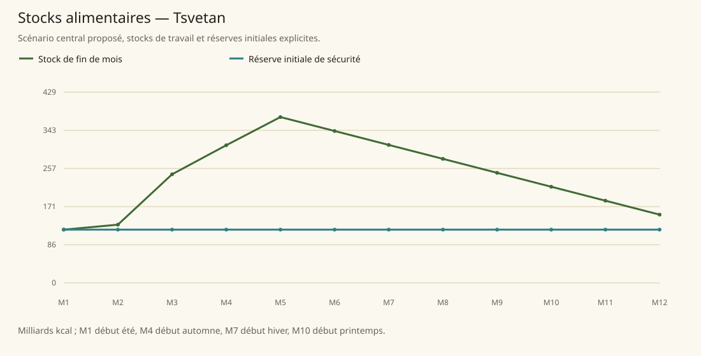

# Tsvetan

[Accueil](../README.md) · [Arbre des métiers](../arbre-metiers.md)

références du contexte régional, pas preuve individuelle de chaque fréquence

[Profil régional détaillé](../Localites/tsvetan.md) : 468 000 habitants au total régional.

## Activités communes

- obsidienne extraction taille outils
- soufre médicinal
- platine bijoux
- peaux vêtements abris
- os construction
- shamans
- chasse et élevage
- agriculture aride
- mercenaires services

## Activités caractéristiques

- peintures guerre spirituelles
- totems
- élevage loups géants
- poisons bêtes magiques
- agriculture champs funéraires

## Usages et contraintes sociales

- Feargus présente une forte précarité ; chômage et mendicité chiffrés sont proposés.
- Eferhild fournit nourriture et eau collectivement et valorise le travail : une mendicité faible est une hypothèse.
- Le bois et plusieurs métaux viennent des importations ou des raids.
- Les gobelins sont souvent travailleurs ou mercenaires, avec des contre-exemples de shamans ; aucune profession n’est verrouillée par espèce.

## Expertises et portée

- Hot Bloods guerriers Voir les sources et la méthode du modèle..
- Spiked Bones éclaireurs/élevage Voir les sources et la méthode du modèle..
- Stone Fangs embuscade chasse pistage Voir les sources et la méthode du modèle..
- Stone Fangs poisons/herbes Voir les sources et la méthode du modèle..
- Strong Fists agriculture aride Voir les sources et la méthode du modèle..

## Villes et communautés

| Profil | Population retenue | Portée |
|---|---|---|
| [Feargus](../Localites/tsvetan--feargus.md) | 20 000 | proposee |
| [Eferhild Citadel](../Localites/tsvetan--eferhild-citadel.md) | 12 000 | proposee |
| [Hot Bloods (campements)](../Localites/tsvetan--hot-bloods-campements.md) | 90 000 | proposee |
| [Spiked Bones (campements)](../Localites/tsvetan--spiked-bones-campements.md) | 120 000 | proposee |
| [Stone Fangs (campements)](../Localites/tsvetan--stone-fangs-campements.md) | 90 000 | proposee |
| [Strong Fists (villages et champs)](../Localites/tsvetan--strong-fists-villages-et-champs.md) | 136 000 | proposee |

## Raisonnement des répartitions

Les fréquences ne proviennent pas d’un recensement de métiers : elles sont distribuées selon filières locales, disponibilité de ressources, habilitations, demande urbaine et contraintes sociales. Les emplois vivriers sont recalibrés à effectifs, espèces et strates conservés ; les raisons et les deltas sont enregistrés, y compris les zéros.

[Tanares Sourcebook p. 190](../Sources/sb.md#p-190), [Tanares Sourcebook p. 191](../Sources/sb.md#p-191), [Tanares Sourcebook p. 192](../Sources/sb.md#p-192), [Tanares Sourcebook p. 193](../Sources/sb.md#p-193), [Tanares Sourcebook p. 194](../Sources/sb.md#p-194), [Tanares Sourcebook p. 195](../Sources/sb.md#p-195), [Tanares Sourcebook p. 196](../Sources/sb.md#p-196), [Tanares Sourcebook p. 197](../Sources/sb.md#p-197).

## Alimentation et échanges

| Indicateur proposé | Résultat |
|---|---|
| Besoin annuel | 478,809 milliards kcal |
| Production naturelle | 478,064 milliards kcal |
| Apport magique direct | 5,057 milliards kcal |
| Imports livrés | 0,000 milliards kcal |
| Exports chargés | 0,000 milliards kcal |
| Couverture énergétique | 100,901 % |
| Surface cultivée | 284 746 ha |
| Surface en rotation | 420 000 ha |
| Part des lipides | 16,617 % |
| Solde du budget public | 1 389 262 po/an |

Les coûts, rendements, bassins d’eau et infrastructures sont des paramètres proposés. Une couverture calorique ne valide pas tous les nutriments ni l’accès marchand de chaque habitant.

### Crises à stocks fixes

| Épreuve | Couverture annuelle | Déficit après stock initial |
|---|---|---|
| Récoltes −30 % | 69,912 % | 0,000 milliards kcal |
| Magie divisée par deux | 96,572 % | 0,000 milliards kcal |
| Route E7 fermée 90 jours | 100,901 % | 0,000 milliards kcal |
| Besoin géants énergie×16 | 100,901 % | 0,000 milliards kcal |

Un déficit nul après réserve initiale ne garantit pas une deuxième année identique : les stocks peuvent s’être réduits.
