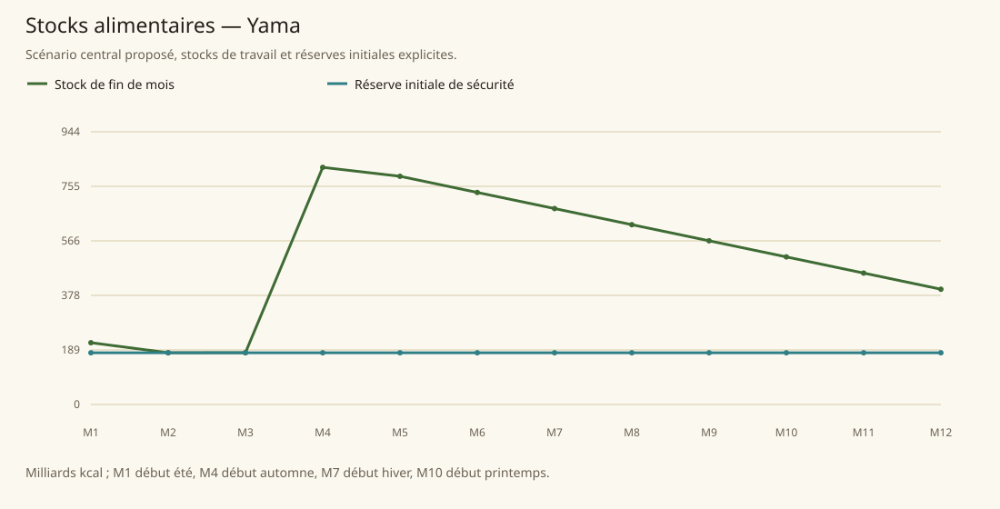

# Yama

[Accueil](../README.md) · [Arbre des métiers](../arbre-metiers.md)

références du contexte régional, pas preuve individuelle de chaque fréquence

[Profil régional détaillé](../Localites/yama.md) : 793 000 habitants au total régional.

## Activités communes

- riziculture
- sériciculture
- acier haute qualité
- herbes et thé
- tameranium
- bureaucratie diplomatie
- sugenjas
- samurai ninjas moines
- commerce fluvial

## Activités caractéristiques

- thés rituels activés maître cérémonie
- traduction Édits
- Ki et armes tameranium
- temples Eido diplomatiques
- tatouages Dragon Clan et spectres ninjas criminels

## Usages et contraintes sociales

- Les fonctions de travailleurs, prêtres et guerriers sont hiérarchisées par clans et castes, sans confondre métier et classe de personnage.
- La grâce de Tenshikin et les tributs de tameranium encadrent l’accès à certaines formations.
- Aucun classement général des artisans de jade ou porcelaine comme meilleurs n’est documenté.
- Les bannis peuvent exercer dans la clandestinité ou ne plus avoir de métier ; ils ne sont comptés qu’une fois.

## Expertises et portée

- acier Voir les sources et la méthode du modèle..
- Ki et thé rituel Voir les sources et la méthode du modèle..
- Tiger Monastery moines maîtres Voir les sources et la méthode du modèle..
- Rokaru samurai Voir les sources et la méthode du modèle..

## Villes et communautés

| Profil | Population retenue | Portée |
|---|---|---|
| [Yamanoma](../Localites/yama--yamanoma.md) | 45 000 | proposee |
| [Tiger Monastery](../Localites/yama--tiger-monastery.md) | 2 500 | proposee |
| [Neshin](../Localites/yama--neshin.md) | 5 000 | proposee |
| [Umay](../Localites/yama--umay.md) | 15 000 | proposee |
| [Bushi](../Localites/yama--bushi.md) | 5 000 | proposee |
| [Autres villes, villages et campagnes (résiduel)](../Localites/yama--autres-villes-villages-et-campagnes-residuel.md) | 720 500 | proposee |

## Raisonnement des répartitions

Les fréquences ne proviennent pas d’un recensement de métiers : elles sont distribuées selon filières locales, disponibilité de ressources, habilitations, demande urbaine et contraintes sociales. Les emplois vivriers sont recalibrés à effectifs, espèces et strates conservés ; les raisons et les deltas sont enregistrés, y compris les zéros.

[Tanares Sourcebook p. 198](../Sources/sb.md#p-198), [Tanares Sourcebook p. 199](../Sources/sb.md#p-199), [Tanares Sourcebook p. 200](../Sources/sb.md#p-200), [Tanares Sourcebook p. 201](../Sources/sb.md#p-201), [Tanares Sourcebook p. 202](../Sources/sb.md#p-202), [Tanares Sourcebook p. 203](../Sources/sb.md#p-203), [Tanares Sourcebook p. 204](../Sources/sb.md#p-204), [Tanares Sourcebook p. 205](../Sources/sb.md#p-205), [Tanares Sourcebook p. 220](../Sources/sb.md#p-220), [Tanares Sourcebook p. 221](../Sources/sb.md#p-221).

## Alimentation et échanges

| Indicateur proposé | Résultat |
|---|---|
| Besoin annuel | 716,119 milliards kcal |
| Production naturelle | 845,411 milliards kcal |
| Apport magique direct | 5,797 milliards kcal |
| Imports livrés | 0,000 milliards kcal |
| Exports chargés | 3,500 milliards kcal |
| Couverture énergétique | 118,375 % |
| Surface cultivée | 298 574 ha |
| Surface en rotation | 325 446 ha |
| Part des lipides | 13,866 % |
| Solde du budget public | 1 513 843 po/an |

Les coûts, rendements, bassins d’eau et infrastructures sont des paramètres proposés. Une couverture calorique ne valide pas tous les nutriments ni l’accès marchand de chaque habitant.

### Crises à stocks fixes

| Épreuve | Couverture annuelle | Déficit après stock initial |
|---|---|---|
| Récoltes −30 % | 83,155 % | 0,000 milliards kcal |
| Magie divisée par deux | 116,792 % | 0,000 milliards kcal |
| Route E7 fermée 90 jours | 118,375 % | 0,000 milliards kcal |
| Besoin géants énergie×16 | 118,375 % | 0,000 milliards kcal |

Un déficit nul après réserve initiale ne garantit pas une deuxième année identique : les stocks peuvent s’être réduits.
