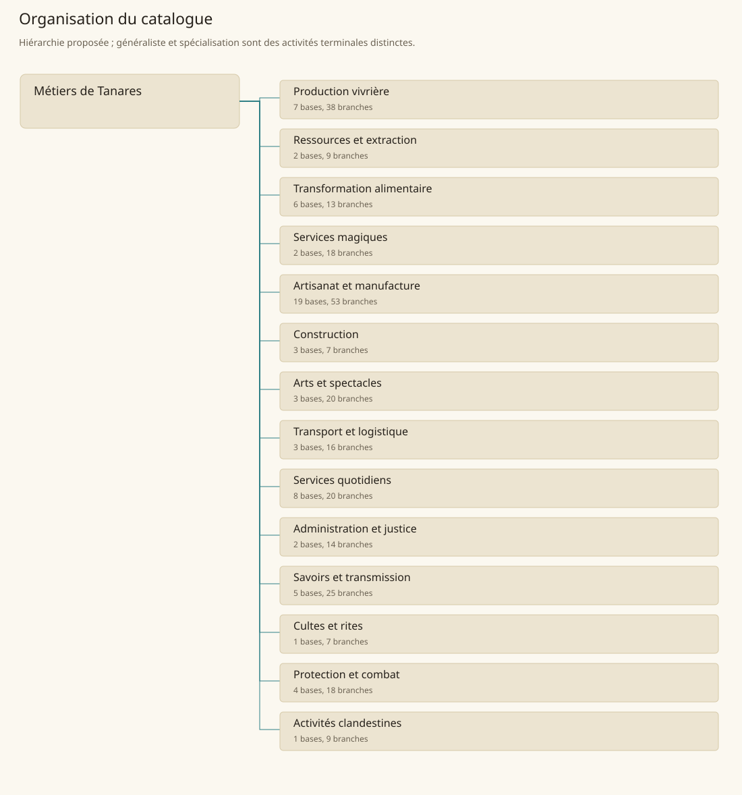

# Arbre des métiers

[Accueil](README.md) · [Arbre des métiers](arbre-metiers.md)

La hiérarchie est un choix de conception : les livres attestent des activités, sans publier cet arbre. **66 bases** regroupent **234 spécialisations** et **33 branches généralistes**. Une personne exerce une seule branche principale ; les familles servent au classement et aux totaux. Les niveaux d’apprentissage et les activités secondaires traversent l’arbre.

## Production vivrière

- [Agriculteur](Bases/agriculture.md)
    - [Agriculteur généraliste](Specialisations/agriculture/agriculture.md) — généraliste
    - [Céréalier](Specialisations/agriculture/cerealier.md) — spécialisation
    - [Riziculteur](Specialisations/agriculture/riziculteur.md) — spécialisation
    - [Vigneron](Specialisations/agriculture/vigneron.md) — spécialisation
    - [Cultivateur d’épices](Specialisations/agriculture/epices.md) — spécialisation
    - [Cultivateur d’herbes pour thé](Specialisations/agriculture/theiculteur.md) — spécialisation
    - [Maraîcher](Specialisations/agriculture/maraicher.md) — spécialisation
    - [Cultivateur de tubercules](Specialisations/agriculture/tuberculier.md) — spécialisation
- [Horticulteur](Bases/horticulture.md)
    - [Jardinier](Specialisations/horticulture/jardinier.md) — spécialisation
    - [Fleuriste](Specialisations/horticulture/fleuriste.md) — spécialisation
    - [Arboriculteur de verger](Specialisations/horticulture/verger.md) — spécialisation
    - [Jardinier de roses magiques](Specialisations/horticulture/roses-magiques.md) — spécialisation
    - [Arboriculteur de breithwood](Specialisations/horticulture/breithwood.md) — spécialisation
- [Éleveur](Bases/elevage.md)
    - [Éleveur généraliste](Specialisations/elevage/elevage.md) — généraliste
    - [Berger](Specialisations/elevage/berger.md) — spécialisation
    - [Éleveur de yaks](Specialisations/elevage/yak.md) — spécialisation
    - [Éleveur de chevaux](Specialisations/elevage/chevaux.md) — spécialisation
    - [Éleveur de chameaux](Specialisations/elevage/chameaux.md) — spécialisation
    - [Éleveur de vers à soie](Specialisations/elevage/sericulture.md) — spécialisation
    - [Éleveur de loups géants](Specialisations/elevage/loups.md) — spécialisation
    - [Éleveur de montures volantes](Specialisations/elevage/montures-volantes.md) — spécialisation
    - [Apiculteur](Specialisations/elevage/apiculteur.md) — spécialisation
- [Chasseur](Bases/chasse.md)
    - [Chasseur de gibier](Specialisations/chasse/chasse.md) — généraliste
    - [Trappeur](Specialisations/chasse/trappeur.md) — spécialisation
    - [Chasseur de monstres](Specialisations/chasse/chasseur-monstres.md) — spécialisation
    - [Chasseur de monstres marins](Specialisations/chasse/chasseur-marin.md) — spécialisation
    - [Chasseur de dragons](Specialisations/chasse/chasseur-dragons.md) — spécialisation
- [Collecteur de ressources](Bases/collecte.md)
    - [Cueilleur](Specialisations/collecte/cueilleur.md) — spécialisation
    - [Herboriste de collecte](Specialisations/collecte/herboriste.md) — spécialisation
    - [Collecteur de composants de créatures](Specialisations/collecte/composants.md) — spécialisation
    - [Collecteur de perles](Specialisations/collecte/perles.md) — spécialisation
    - [Récupérateur de reliques penumbrales](Specialisations/collecte/collecteur-penumbral.md) — spécialisation
- [Travailleur forestier](Bases/foresterie.md)
    - [Bûcheron](Specialisations/foresterie/bucheron.md) — spécialisation
    - [Forestier](Specialisations/foresterie/forestier.md) — spécialisation
    - [Scieur](Specialisations/foresterie/scieur.md) — spécialisation
- [Pêcheur](Bases/peche.md)
    - [Pêcheur maritime](Specialisations/peche/peche.md) — généraliste
    - [Pêcheur d’eau douce](Specialisations/peche/peche-douce.md) — spécialisation
    - [Cultivateur marin](Specialisations/peche/cultivateur-marin.md) — spécialisation

## Ressources et extraction

- [Extracteur de ressources minérales](Bases/extraction.md)
    - [Mineur](Specialisations/extraction/mineur.md) — spécialisation
    - [Carrier](Specialisations/extraction/carrier.md) — spécialisation
    - [Salinier](Specialisations/extraction/salinier.md) — spécialisation
    - [Mineur de bauronite](Specialisations/extraction/bauronite.md) — spécialisation
    - [Mineur de tameranium](Specialisations/extraction/tameranium.md) — spécialisation
    - [Extracteur d’obsidienne](Specialisations/extraction/obsidienne.md) — spécialisation
    - [Extracteur de soufre](Specialisations/extraction/soufre.md) — spécialisation
    - [Prospecteur](Specialisations/extraction/prospecteur.md) — spécialisation
- [Charbonnier](Bases/charbon.md)
    - [Charbonnier](Specialisations/charbon/charbonnier.md) — généraliste

## Transformation alimentaire

- [Meunier](Bases/meunerie.md)
    - [Meunier](Specialisations/meunerie/meunier.md) — généraliste
- [Boucher](Bases/boucherie.md)
    - [Boucher](Specialisations/boucherie/boucher.md) — généraliste
    - [Écorcheur](Specialisations/boucherie/ecorcheur.md) — spécialisation
- [Boulanger](Bases/boulangerie.md)
    - [Boulanger](Specialisations/boulangerie/boulanger.md) — généraliste
- [Cuisinier](Bases/cuisine.md)
    - [Cuisinier](Specialisations/cuisine/cuisinier.md) — généraliste
    - [Cuisinier de haute cuisine](Specialisations/cuisine/haute-cuisine.md) — spécialisation
- [Transformateur alimentaire](Bases/conservation.md)
    - [Poissonnier](Specialisations/conservation/poissonnier.md) — spécialisation
    - [Saleur et sécheur alimentaire](Specialisations/conservation/saleur.md) — spécialisation
    - [Fromager](Specialisations/conservation/fromager.md) — spécialisation
    - [Huilier](Specialisations/conservation/huilier.md) — spécialisation
- [Fabricant de boissons](Bases/boissons.md)
    - [Brasseur](Specialisations/boissons/brasseur.md) — spécialisation
    - [Distillateur](Specialisations/boissons/distillateur.md) — spécialisation
    - [Distillateur de Highlandtuber](Specialisations/boissons/highlandtuber.md) — spécialisation

## Services magiques

- [Alchimiste](Bases/alchimie.md)
    - [Alchimiste](Specialisations/alchimie/alchimiste.md) — généraliste
    - [Apothicaire](Specialisations/alchimie/apothicaire.md) — spécialisation
    - [Préparateur de poisons](Specialisations/alchimie/empoisonneur.md) — spécialisation
    - [Préparateur de potions](Specialisations/alchimie/potions.md) — spécialisation
    - [Préparateur d’Estelindea](Specialisations/alchimie/estelindea.md) — spécialisation
- [Praticien des services arcaniques](Bases/arcane.md)
    - [Chercheur en magie](Specialisations/arcane/chercheur-magie.md) — spécialisation
    - [Fabricant d’objets magiques](Specialisations/arcane/enchanteur.md) — spécialisation
    - [Fabricant de parchemins magiques](Specialisations/arcane/parchemins-magiques.md) — spécialisation
    - [Nécromancien de service](Specialisations/arcane/necromancien.md) — spécialisation
    - [Illusionniste de service](Specialisations/arcane/illusionniste.md) — spécialisation
    - [Chercheur en aethermancy](Specialisations/arcane/aethermancie.md) — spécialisation
    - [Chercheur en biomancy](Specialisations/arcane/biomancie.md) — spécialisation
    - [Désenchanteur et récupérateur arcanique](Specialisations/arcane/desenchanteur.md) — spécialisation
    - [Extracteur de mémoire](Specialisations/arcane/memoire.md) — spécialisation
    - [Certificateur et inspecteur arcanique](Specialisations/arcane/certificateur.md) — spécialisation
    - [Opérateur de transport magique](Specialisations/arcane/portail.md) — spécialisation
    - [Restaurateur de runes de tunnels](Specialisations/arcane/runier.md) — spécialisation
    - [Artificier psychique](Specialisations/arcane/psychique.md) — spécialisation

## Artisanat et manufacture

- [Métallurgiste](Bases/metallurgie.md)
    - [Fondeur et affineur](Specialisations/metallurgie/fondeur.md) — spécialisation
    - [Aciériste](Specialisations/metallurgie/acieriste.md) — spécialisation
- [Forgeron](Bases/forge.md)
    - [Forgeron](Specialisations/forge/forgeron.md) — généraliste
    - [Armurier](Specialisations/forge/armurier.md) — spécialisation
    - [Coutelier](Specialisations/forge/coutelier.md) — spécialisation
    - [Rémouleur](Specialisations/forge/remouleur.md) — spécialisation
- [Mécanicien et artisan du métal](Bases/mecanique.md)
    - [Serrurier](Specialisations/mecanique/serrurier.md) — spécialisation
    - [Rétameur](Specialisations/mecanique/retameur.md) — spécialisation
    - [Réparateur et bricoleur](Specialisations/mecanique/reparateur.md) — spécialisation
    - [Horloger](Specialisations/mecanique/horloger.md) — spécialisation
    - [Fabricant d’outils de précision](Specialisations/mecanique/precision.md) — spécialisation
    - [Fabricant d’instruments de navigation](Specialisations/mecanique/compas.md) — spécialisation
- [Bijoutier](Bases/bijouterie.md)
    - [Bijoutier](Specialisations/bijouterie/bijoutier.md) — généraliste
    - [Orfèvre](Specialisations/bijouterie/orfevre.md) — spécialisation
    - [Lapidaire et tailleur de gemmes](Specialisations/bijouterie/lapidaire.md) — spécialisation
- [Tanneur](Bases/tannage.md)
    - [Tanneur](Specialisations/tannage/tanneur.md) — généraliste
    - [Fourreur](Specialisations/tannage/fourreur.md) — spécialisation
- [Artisan du cuir](Bases/cuir.md)
    - [Maroquinier](Specialisations/cuir/maroquinier.md) — spécialisation
    - [Bourrelier et sellier](Specialisations/cuir/bourrelier.md) — spécialisation
    - [Boursier, fabricant de bourses](Specialisations/cuir/boursier.md) — spécialisation
    - [Gantier](Specialisations/cuir/gantier.md) — spécialisation
    - [Cordonnier](Specialisations/cuir/cordonnier.md) — spécialisation
- [Artisan textile](Bases/textile.md)
    - [Fileur](Specialisations/textile/fileur.md) — spécialisation
    - [Tisserand](Specialisations/textile/tisserand.md) — spécialisation
    - [Teinturier](Specialisations/textile/teinturier.md) — spécialisation
- [Tailleur de vêtements](Bases/habillement.md)
    - [Tailleur](Specialisations/habillement/tailleur.md) — spécialisation
    - [Modiste et fabricant de coiffes](Specialisations/habillement/modiste.md) — spécialisation
- [Tapissier](Bases/tapisserie.md)
    - [Tapissier](Specialisations/tapisserie/tapissier.md) — généraliste
- [Menuisier](Bases/bois.md)
    - [Menuisier](Specialisations/bois/menuisier.md) — généraliste
    - [Ébéniste](Specialisations/bois/ebeniste.md) — spécialisation
    - [Sculpteur sur bois](Specialisations/bois/sculpteur-bois.md) — spécialisation
    - [Tonnelier](Specialisations/bois/tonnelier.md) — spécialisation
    - [Charron](Specialisations/bois/charron.md) — spécialisation
- [Constructeur naval](Bases/navale.md)
    - [Constructeur naval](Specialisations/navale/constructeur-naval.md) — généraliste
    - [Calfat](Specialisations/navale/calfat.md) — spécialisation
    - [Constructeur de drakkars](Specialisations/navale/drakkar.md) — spécialisation
- [Cordier](Bases/cordage.md)
    - [Cordier](Specialisations/cordage/cordier.md) — généraliste
    - [Voilier](Specialisations/cordage/voilier.md) — spécialisation
- [Facteur d’arcs](Bases/archerie.md)
    - [Facteur d’arcs](Specialisations/archerie/facteur-arcs.md) — généraliste
    - [Fabricant de flèches](Specialisations/archerie/facteur-fleches.md) — spécialisation
- [Luthier](Bases/lutherie.md)
    - [Luthier et facteur d’instruments](Specialisations/lutherie/luthier.md) — généraliste
- [Tailleur de pierre](Bases/pierre.md)
    - [Tailleur de pierre](Specialisations/pierre/tailleur-pierre.md) — généraliste
    - [Sculpteur sur pierre](Specialisations/pierre/sculpteur-pierre.md) — spécialisation
    - [Sculpteur de statues de Stone Spirits](Specialisations/pierre/statues-esprits.md) — spécialisation
- [Potier](Bases/ceramique.md)
    - [Potier](Specialisations/ceramique/potier.md) — généraliste
    - [Tuilier](Specialisations/ceramique/tuilier.md) — spécialisation
    - [Porcelainier](Specialisations/ceramique/porcelainier.md) — spécialisation
- [Verrier](Bases/verre.md)
    - [Souffleur de verre](Specialisations/verre/souffleur-verre.md) — spécialisation
    - [Vitrier](Specialisations/verre/vitrier.md) — spécialisation
    - [Opticien et fabricant de lentilles](Specialisations/verre/opticien.md) — spécialisation
- [Papetier et artisan du livre](Bases/papier.md)
    - [Papetier](Specialisations/papier/papetier.md) — spécialisation
    - [Relieur](Specialisations/papier/relieur.md) — spécialisation
- [Chandelier](Bases/eclairage.md)
    - [Chandelier](Specialisations/eclairage/chandelier.md) — généraliste

## Construction

- [Charpentier](Bases/charpente.md)
    - [Charpentier](Specialisations/charpente/charpentier.md) — généraliste
    - [Couvreur](Specialisations/charpente/couvreur.md) — spécialisation
- [Maçon](Bases/maconnerie.md)
    - [Maçon](Specialisations/maconnerie/macon.md) — généraliste
    - [Plâtrier](Specialisations/maconnerie/platrier.md) — spécialisation
    - [Manœuvre de chantier](Specialisations/maconnerie/manoeuvre.md) — spécialisation
- [Architecte](Bases/architecture.md)
    - [Architecte](Specialisations/architecture/architecte.md) — généraliste
    - [Géomètre et arpenteur](Specialisations/architecture/arpenteur.md) — spécialisation

## Arts et spectacles

- [Peintre](Bases/peinture.md)
    - [Peintre](Specialisations/peinture/peintre.md) — généraliste
    - [Fabricant d’enseignes](Specialisations/peinture/enseignes.md) — spécialisation
    - [Enlumineur](Specialisations/peinture/enlumineur.md) — spécialisation
    - [Peintre de guerre spirituel](Specialisations/peinture/peinture-sacree.md) — spécialisation
    - [Tatoueur rituel](Specialisations/peinture/tatoueur.md) — spécialisation
- [Artiste du spectacle](Bases/spectacle.md)
    - [Acteur et comédien](Specialisations/spectacle/acteur.md) — spécialisation
    - [Danseur](Specialisations/spectacle/danseur.md) — spécialisation
    - [Musicien](Specialisations/spectacle/musicien.md) — spécialisation
    - [Chanteur](Specialisations/spectacle/chanteur.md) — spécialisation
    - [Poète](Specialisations/spectacle/poete.md) — spécialisation
    - [Conteur](Specialisations/spectacle/conteur.md) — spécialisation
    - [Bouffon](Specialisations/spectacle/bouffon.md) — spécialisation
    - [Jongleur](Specialisations/spectacle/jongleur.md) — spécialisation
    - [Acrobate](Specialisations/spectacle/acrobate.md) — spécialisation
    - [Cracheur de feu](Specialisations/spectacle/cracheur-feu.md) — spécialisation
    - [Compositeur](Specialisations/spectacle/compositeur.md) — spécialisation
    - [Crieur public](Specialisations/spectacle/crieur.md) — spécialisation
- [Professionnel du jeu](Bases/jeu.md)
    - [Joueur professionnel](Specialisations/jeu/joueur.md) — spécialisation
    - [Croupier](Specialisations/jeu/croupier.md) — spécialisation
    - [Preneur de paris](Specialisations/jeu/bookmaker.md) — spécialisation

## Transport et logistique

- [Transporteur terrestre](Bases/transport.md)
    - [Portefaix](Specialisations/transport/portefaix.md) — spécialisation
    - [Docker](Specialisations/transport/docker.md) — spécialisation
    - [Magasinier](Specialisations/transport/magasinier.md) — spécialisation
    - [Charretier et cocher](Specialisations/transport/charretier.md) — spécialisation
    - [Chef de caravane](Specialisations/transport/chef-caravane.md) — spécialisation
    - [Coursier et messager](Specialisations/transport/messager.md) — spécialisation
    - [Porteur d’eau](Specialisations/transport/porteur-eau.md) — spécialisation
    - [Transporteur de canopée](Specialisations/transport/canopée.md) — spécialisation
    - [Opérateur de Stone Disks](Specialisations/transport/stone-disks.md) — spécialisation
    - [Palefrenier et soigneur d’écurie](Specialisations/transport/palefrenier.md) — spécialisation
- [Marin](Bases/navigation.md)
    - [Marin](Specialisations/navigation/marin.md) — généraliste
    - [Navigateur](Specialisations/navigation/navigateur.md) — spécialisation
    - [Pilote de port](Specialisations/navigation/pilote-port.md) — spécialisation
    - [Capitaine de navire](Specialisations/navigation/capitaine.md) — spécialisation
    - [Pilote de véhicule volant](Specialisations/navigation/pilote-volant.md) — spécialisation
- [Guide](Bases/guidage.md)
    - [Guide](Specialisations/guidage/guide.md) — généraliste

## Services quotidiens

- [Hôte professionnel](Bases/accueil.md)
    - [Aubergiste](Specialisations/accueil/aubergiste.md) — spécialisation
    - [Tavernier](Specialisations/accueil/tavernier.md) — spécialisation
- [Employé domestique et aide familiale](Bases/services.md)
    - [Domestique](Specialisations/services/domestique.md) — spécialisation
    - [Gardien d’enfants](Specialisations/services/garde-enfants.md) — spécialisation
- [Agent d’entretien](Bases/hygiene.md)
    - [Terrassier d’hygiène urbaine](Specialisations/hygiene/terrassier.md) — spécialisation
    - [Ramoneur](Specialisations/hygiene/ramoneur.md) — spécialisation
- [Agent funéraire](Bases/funeraire.md)
    - [Fossoyeur](Specialisations/funeraire/fossoyeur.md) — spécialisation
    - [Gardien de cimetière](Specialisations/funeraire/gardien-cimetiere.md) — spécialisation
    - [Momificateur](Specialisations/funeraire/momificateur.md) — spécialisation
    - [Gardien d’arbres funéraires](Specialisations/funeraire/arbres-funeraires.md) — spécialisation
- [Marchand](Bases/commerce.md)
    - [Marchand](Specialisations/commerce/marchand.md) — généraliste
    - [Colporteur](Specialisations/commerce/colporteur.md) — spécialisation
    - [Courtier](Specialisations/commerce/courtier.md) — spécialisation
    - [Commissaire-priseur d’objets magiques](Specialisations/commerce/priseur.md) — spécialisation
- [Soigneur](Bases/sante.md)
    - [Guérisseur](Specialisations/sante/guerisseur.md) — spécialisation
    - [Chirurgien](Specialisations/sante/chirurgien.md) — spécialisation
    - [Praticien de psychosurgery](Specialisations/sante/psychosurgery.md) — spécialisation
    - [Opérateur de thérapie onirique](Specialisations/sante/onirique.md) — spécialisation
- [Barbier](Bases/barberie.md)
    - [Barbier](Specialisations/barberie/barbier.md) — généraliste
- [Maître de cérémonie du thé](Bases/rituel-the.md)
    - [Maître de cérémonie du thé](Specialisations/rituel-the/maitre-the.md) — généraliste

## Administration et justice

- [Professionnel de finance](Bases/finance.md)
    - [Comptable](Specialisations/finance/comptable.md) — spécialisation
    - [Banquier et employé de banque](Specialisations/finance/banquier.md) — spécialisation
    - [Usurier et prêteur sur gages](Specialisations/finance/usurier.md) — spécialisation
    - [Changeur](Specialisations/finance/changeur.md) — spécialisation
    - [Assureur](Specialisations/finance/assureur.md) — spécialisation
    - [Estimateur](Specialisations/finance/estimateur.md) — spécialisation
    - [Négociateur](Specialisations/finance/negociateur.md) — spécialisation
- [Administrateur et juriste](Bases/administration.md)
    - [Fonctionnaire](Specialisations/administration/fonctionnaire.md) — spécialisation
    - [Percepteur](Specialisations/administration/percepteur.md) — spécialisation
    - [Juge](Specialisations/administration/juge.md) — spécialisation
    - [Avocat](Specialisations/administration/avocat.md) — spécialisation
    - [Diplomate et émissaire](Specialisations/administration/diplomate.md) — spécialisation
    - [Recruteur et agent de missions](Specialisations/administration/recruteur.md) — spécialisation
    - [Bourreau](Specialisations/administration/bourreau.md) — spécialisation

## Savoirs et transmission

- [Scribe et auteur](Bases/ecriture.md)
    - [Scribe](Specialisations/ecriture/scribe.md) — spécialisation
    - [Calligraphe](Specialisations/ecriture/calligraphe.md) — spécialisation
    - [Écrivain](Specialisations/ecriture/ecrivain.md) — spécialisation
    - [Journaliste et rédacteur](Specialisations/ecriture/journaliste.md) — spécialisation
    - [Traducteur](Specialisations/ecriture/traducteur.md) — spécialisation
- [Érudit](Bases/savoir.md)
    - [Bibliothécaire](Specialisations/savoir/bibliothecaire.md) — spécialisation
    - [Conservateur de musée](Specialisations/savoir/conservateur.md) — spécialisation
    - [Historien](Specialisations/savoir/historien.md) — spécialisation
    - [Astronome](Specialisations/savoir/astronome.md) — spécialisation
    - [Chercheur non arcanique](Specialisations/savoir/chercheur.md) — spécialisation
    - [Mathématicien](Specialisations/savoir/mathematicien.md) — spécialisation
    - [Philosophe](Specialisations/savoir/philosophe.md) — spécialisation
    - [Archéologue](Specialisations/savoir/archeologue.md) — spécialisation
- [Enseignant](Bases/enseignement.md)
    - [Professeur](Specialisations/enseignement/professeur.md) — spécialisation
    - [Enseignant de magie arcanique](Specialisations/enseignement/prof-arcane.md) — spécialisation
    - [Instructeur martial](Specialisations/enseignement/instructeur-martial.md) — spécialisation
    - [Formateur de tir à l’arc](Specialisations/enseignement/instructeur-arc.md) — spécialisation
- [Ingénieur](Bases/ingenierie.md)
    - [Ingénieur](Specialisations/ingenierie/ingenieur.md) — généraliste
    - [Inventeur](Specialisations/ingenierie/inventeur.md) — spécialisation
    - [Ingénieur mystique](Specialisations/ingenierie/ingenieur-mystique.md) — spécialisation
    - [Créateur et mainteneur de golems](Specialisations/ingenierie/golemicien.md) — spécialisation
    - [Chercheur en golems](Specialisations/ingenierie/chercheur-golems.md) — spécialisation
    - [Ingénieur de réacteurs de bauronite](Specialisations/ingenierie/reacteur.md) — spécialisation
    - [Technicien de communication runique](Specialisations/ingenierie/communication-runique.md) — spécialisation
- [Cartographe](Bases/cartographie.md)
    - [Cartographe](Specialisations/cartographie/cartographe.md) — généraliste

## Cultes et rites

- [Officiant religieux](Bases/religion.md)
    - [Prêtre et officiant](Specialisations/religion/pretre.md) — spécialisation
    - [Acolyte](Specialisations/religion/acolyte.md) — spécialisation
    - [Shaman](Specialisations/religion/shaman.md) — spécialisation
    - [Sugenja](Specialisations/religion/sugenja.md) — spécialisation
    - [Gardien et officiant druidique](Specialisations/religion/druide.md) — spécialisation
    - [Gardien-purificateur de Mother Tree](Specialisations/religion/mothertree.md) — spécialisation
    - [Officiant des rites Ba-Akhu](Specialisations/religion/ba-akhu.md) — spécialisation

## Protection et combat

- [Garde et surveillant](Bases/securite.md)
    - [Garde et sentinelle](Specialisations/securite/garde.md) — spécialisation
    - [Garde du corps](Specialisations/securite/garde-corps.md) — spécialisation
    - [Veilleur de nuit](Specialisations/securite/veilleur.md) — spécialisation
    - [Gardien de domaine](Specialisations/securite/gardien-domaine.md) — spécialisation
    - [Inquisiteur](Specialisations/securite/inquisiteur.md) — spécialisation
- [Enquêteur et agent de renseignement](Bases/renseignement.md)
    - [Détective](Specialisations/renseignement/detective.md) — spécialisation
    - [Espion](Specialisations/renseignement/espion.md) — spécialisation
    - [Détective arcanique](Specialisations/renseignement/detective-arcane.md) — spécialisation
- [Protecteur et contrôleur arcanique](Bases/controle-arcane.md)
    - [Spellshield](Specialisations/controle-arcane/spellshield.md) — spécialisation
    - [Warden des Arcane Enforcers](Specialisations/controle-arcane/warden.md) — spécialisation
    - [Mage impérial chargé du contrôle](Specialisations/controle-arcane/mage-imperial.md) — spécialisation
- [Combattant professionnel](Bases/combat.md)
    - [Soldat](Specialisations/combat/soldat.md) — spécialisation
    - [Mercenaire](Specialisations/combat/mercenaire.md) — spécialisation
    - [Éclaireur](Specialisations/combat/eclaireur.md) — spécialisation
    - [Gladiateur](Specialisations/combat/gladiateur.md) — spécialisation
    - [Champion d’arène](Specialisations/combat/champion.md) — spécialisation
    - [Chasseur de primes](Specialisations/combat/chasseur-primes.md) — spécialisation
    - [Chasseur de morts-vivants](Specialisations/combat/chasseur-undead.md) — spécialisation

## Activités clandestines

- [Opérateur d’activités illicites](Bases/crime.md)
    - [Maître-chanteur](Specialisations/crime/maitre-chanteur.md) — spécialisation
    - [Cambrioleur](Specialisations/crime/cambrioleur.md) — spécialisation
    - [Homme de main](Specialisations/crime/homme-main.md) — spécialisation
    - [Receleur](Specialisations/crime/receleur.md) — spécialisation
    - [Voleur de grand chemin](Specialisations/crime/voleur-route.md) — spécialisation
    - [Tueur à gages](Specialisations/crime/tueur-gages.md) — spécialisation
    - [Pickpocket](Specialisations/crime/pickpocket.md) — spécialisation
    - [Contrebandier](Specialisations/crime/contrebandier.md) — spécialisation
    - [Pirate](Specialisations/crime/pirate.md) — spécialisation
