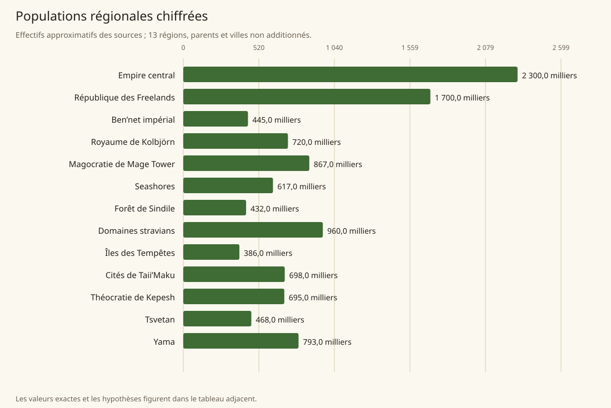
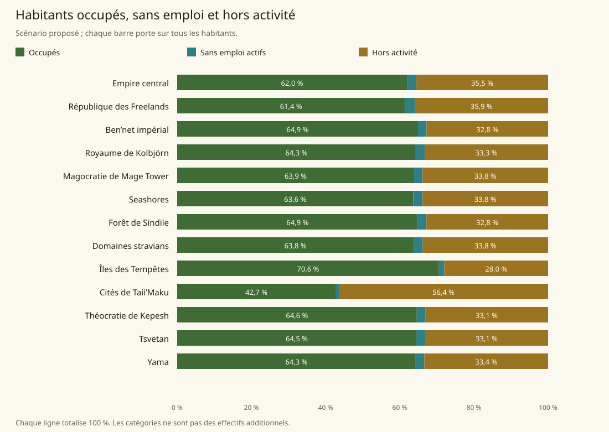
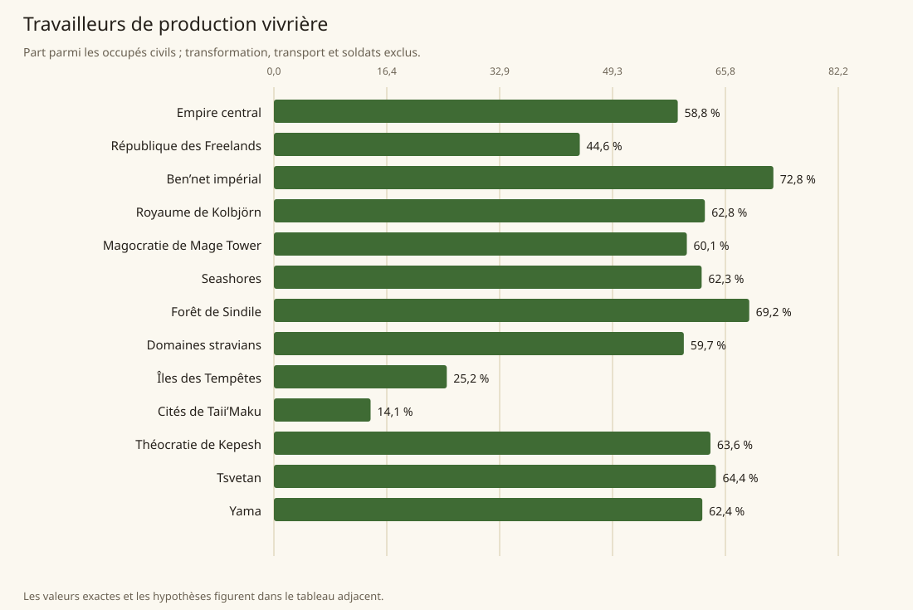
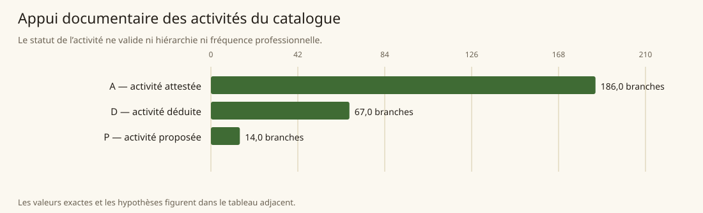
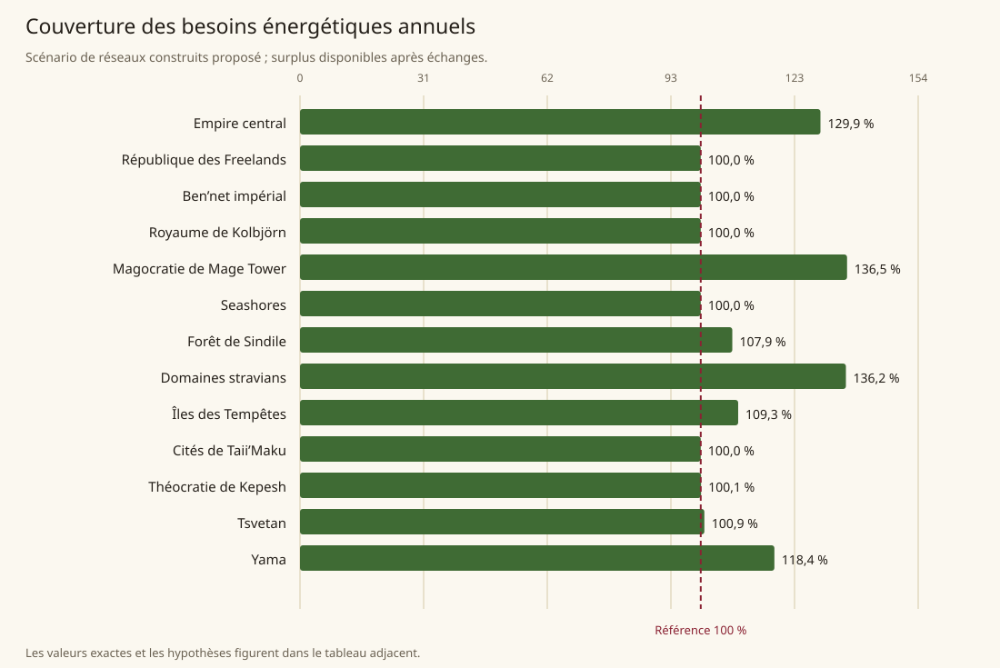
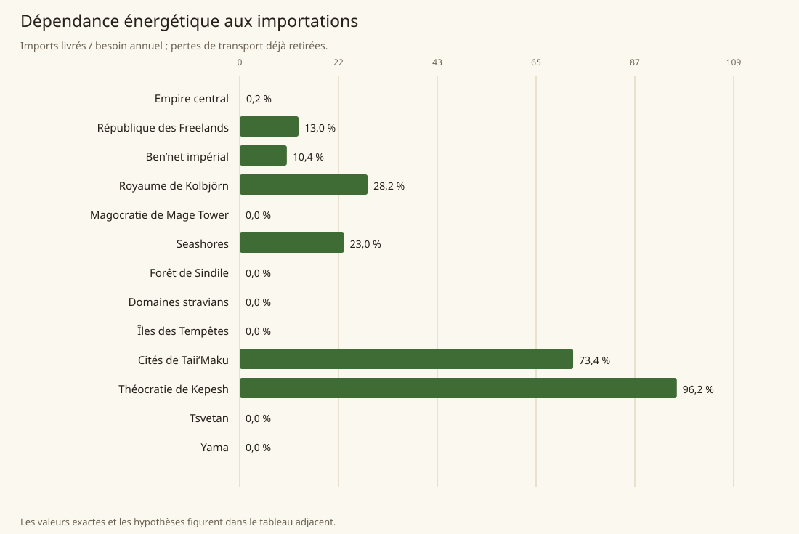
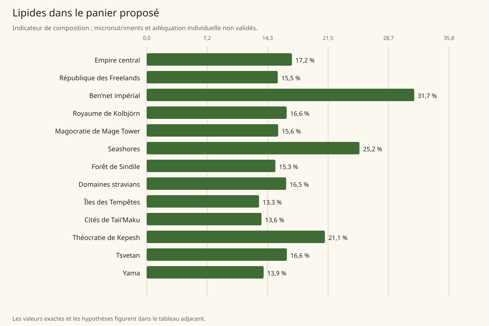

# Lire les graphiques

[Accueil](README.md) · [Arbre des métiers](arbre-metiers.md)

Les graphiques utilisent les valeurs publiées, sans recalibrage. Les couleurs ne signifient pas classement des races ou des milieux. Les dénominateurs, unités et portée des hypothèses sont écrits à côté de chaque figure.

## Les 13 populations régionales approximatives des sources

## Les trois statuts parmi tous habitants, propositions de répartition

## Les producteurs primaires parmi les occupés civils, proposition

## L’appui des activités attestées, déduites et proposées

## La couverture énergétique du réseau central proposé

## Les calories importées livrées rapportées au besoin annuel

## La composition en lipides des paniers proposés

## Valeurs numériques des régions

| Région | Population | Actifs / habitants | Vivrier / occupés civils | Couverture | Imports / besoin | Lipides / énergie |
|---|---|---|---|---|---|---|
| [Empire central](Regions/empire.md) | 2 300 000 | 64,490 % | 58,827 % | 129,870 % | 0,154 % | 17,220 % |
| [République des Freelands](Regions/freelands.md) | 1 700 000 | 64,097 % | 44,557 % | 100,000 % | 12,967 % | 15,539 % |
| [Ben’net impérial](Regions/bennet.md) | 445 000 | 67,223 % | 72,753 % | 100,000 % | 10,371 % | 31,721 % |
| [Royaume de Kolbjörn](Regions/kolbjorn.md) | 720 000 | 66,722 % | 62,776 % | 100,000 % | 28,162 % | 16,594 % |
| [Magocratie de Mage Tower](Regions/magocracy.md) | 867 000 | 66,178 % | 60,149 % | 136,512 % | 0,000 % | 15,591 % |
| [Seashores](Regions/seashores.md) | 617 000 | 66,172 % | 62,306 % | 100,000 % | 22,971 % | 25,232 % |
| [Forêt de Sindile](Regions/sindile.md) | 432 000 | 67,199 % | 69,237 % | 107,876 % | 0,000 % | 15,258 % |
| [Domaines stravians](Regions/stravian.md) | 960 000 | 66,220 % | 59,709 % | 136,225 % | 0,000 % | 16,534 % |
| [Îles des Tempêtes](Regions/storm.md) | 386 000 | 72,000 % | 25,185 % | 109,340 % | 0,000 % | 13,323 % |
| [Cités de Taii’Maku](Regions/taiimaku.md) | 698 000 | 43,582 % | 14,084 % | 100,000 % | 73,395 % | 13,613 % |
| [Théocratie de Kepesh](Regions/kepesh.md) | 695 000 | 66,889 % | 63,587 % | 100,081 % | 96,212 % | 21,128 % |
| [Tsvetan](Regions/tsvetan.md) | 468 000 | 66,862 % | 64,383 % | 100,901 % | 0,000 % | 16,617 % |
| [Yama](Regions/yama.md) | 793 000 | 66,634 % | 62,403 % | 118,375 % | 0,000 % | 13,866 % |

Les graphiques mensuels des stocks figurent dans chaque région, avec la réserve de sécurité distincte du stock de saison.
