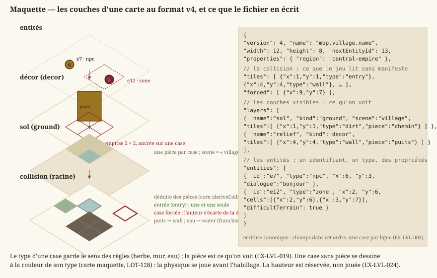

# Cartes & format

> Statut : **format v5 livré au `LOT-1018`** (`jadg-map` : une description par carte, ce que Core
> joue et ce que le moteur construit, étages praticables, volumes ; construite en niveau par
> `scripts/maps/build_level.py`, relue par `scripts/maps/read_level.py` ; §2). Les quatre cartes de
> la démo (`central-empire/capital/`) sont **migrées** de la v4 telles quelles. La §1 décrit la
> grille et les entités, communes aux deux versions, et la v4, que Core lit toujours.
> Dépend de [`gameplay.md`](gameplay.md). Schéma publié (v5) :
> `Documentation/Specification/level.schema.json`.

## 1. Représentation des cartes

Une carte est faite de **couches empilées** et d'une **collision** qui, elle, n'est pas une couche
comme les autres : elle se déduit des pièces posées, et l'auteur ne la corrige qu'au cas par cas.
La maquette montre cet empilement et, en regard, ce que le fichier en écrit.



Deux idées de ce dessin commandent tout le reste du document : le **type** d'une case porte le sens
des règles — herbe, mur, eau —, tandis que la **pièce** ne porte que ce qu'on voit ; et la collision
se **déduit**, si bien qu'une carte reste jouable avant d'être habillée.

- **EX-LVL-001** — Une carte doit être décrite par un **fichier de données**
  externe (pas en dur dans le code), placé dans `Source/Elements/Levels`.
- **EX-LVL-002** — Le format doit décrire au minimum : dimensions de la grille,
  type de chaque tuile, position d'entrée, couches visibles et entités.
- **EX-LVL-003** — Le format retenu est un **JSON structuré orienté objets** : une
  carte est un objet JSON portant ses **métadonnées** (nom, dimensions) et une **liste de tuiles**,
  chaque tuile étant un **objet** `{x, y, type, …}` (les cases vides sont omises) pouvant porter des
  **champs propres** (la pièce nommée par une case de couche, `"piece"`, `EX-LVL-019`). Choisi pour un
  format
  **extensible** (données riches par tuile, *round-trip* d'éditeur direct), au prix d'une lisibilité
  « à l'œil » moindre qu'une grille ASCII — l'édition passe par l'**éditeur**, pas par le texte brut.
- **EX-LVL-005** — Le fichier de carte doit porter un **numéro de version de
  format**, afin qu'une évolution non rétrocompatible soit **détectée** plutôt que subie. Un fichier
  **sans** numéro de version est lu comme la version initiale, sans erreur ni avertissement ; une
  version supérieure à celle gérée est refusée avec un message explicite. **Toute version passée se
  lit pour toujours** (une fixture par version reste dans les tests) ; la conversion est un acte
  explicite (`LevelEditor --migrate`, `EX-EDIT-062`), jamais l'effet de bord d'un enregistrement ;
  l'écriture est **canonique** : charger puis enregistrer une carte intacte rend le même fichier,
  octet pour octet.
- **EX-LVL-004** — Le chargement d'une carte doit **valider** les données
  (positions des tuiles et des entités **dans les bornes** `width × height`, une seule tuile par case,
  **une et une seule entrée**, types de tuile connus) et signaler une erreur exploitable en cas de
  fichier invalide (cf. politique d'erreurs des conventions).
- **EX-LVL-016** — Une carte doit porter **N couches de tuiles typées** plutôt
  qu'une grille unique : un RPG en vue de dessus superpose un **sol** (herbe, dalle, eau), un
  **décor** (arbre, tonneau, tapis) et une **collision** — masque indépendant du visuel, un tapis se
  traverse et un tonneau non. La grille de **collision** d'une carte est son tableau racine `tiles`,
  celui qui porte déjà l'entrée — **déduite** des couches visibles depuis la v4 (`EX-LVL-020`) : le
  tableau `layers` ne décrit que les couches **visibles**, et une
  couche de rôle `collision` qui y serait déclarée est **refusée** — deux grilles à tenir d'accord se
  désynchronisent, et c'est celle qu'on ne voit pas qui gagne. Au chargement, la grille racine est
  **promue** en couche de tête, pour que tout consommateur boucle sur les couches sans cas
  particulier. Un fichier **sans** tableau `layers` se charge, sa grille promue en couche unique dite
  *legacy*, à la fois décor et collision. Concrétisé en `LOT-04`.
- **EX-LVL-017** — Une carte doit porter une **liste d'entités** — PNJ, coffres,
  panneaux, portails, rencontres — distincte de ses grilles : une entité est un **objet** à type
  libre, placé sur une case et porteur de ses propres données, là où une grille ne retient qu'un
  type par case. Le type n'est **pas** interprété au chargement — c'est le gameplay qui lui donne un
  sens — mais la position est validée comme celle d'une tuile (`EX-LVL-004`). Concrétisé en
  `LOT-04`.
- **EX-LVL-018** — Une couche et une entité doivent pouvoir porter un
  **dictionnaire de propriétés libres**, et tout champ **inconnu** du chargeur doit y être rangé :
  ignoré sans erreur à la lecture, et **réémis** à l'écriture. Sans quoi le moindre besoin découvert
  plus tard — terrain difficile, couverture, hauteur, dialogue d'un PNJ — imposerait une nouvelle
  version de format et la migration de tout le contenu déjà produit. Concrétisé en `LOT-04`.

### Format v4 (`LOT-EDITOR-12`)

La seule révision de format du module éditeur, faite tant qu'il n'y avait que trois cartes.

- **EX-LVL-019** — Chaque case d'une couche visible porte son **type** et une
  **pièce** facultative de la planche du lieu (`"piece"`). Le type ne garde qu'un sens, celui des
  règles et du générateur ; la pièce est ce qu'on voit, et la table d'apparence du lieu n'en est que
  le **défaut** (cartes générées, case sans pièce). Une pièce **large** est ancrée sur une case et
  occupe son emprise vers les colonnes et lignes croissantes ; elle se trie au pied de son emprise
  (`core::footprintCells`, une seule règle, lue par la composition du jeu et par la déduction de
  collision). Une pièce se cite par son nom courant ou par un ancien nom (`aliases` du manifeste) ;
  une pièce introuvable reste dans le fichier.
- **EX-LVL-020** — La grille de collision est **écrite** dans le fichier — le
  jeu la lit sans manifeste — et **égale à sa déduction** (`core::deriveCollision`) hors des cases
  que l'auteur a **forcées** (`"forced"`). La déduction prend, case par case, la contribution la plus
  forte du **type tactique** de chaque pièce qui la couvre (`tactical` au manifeste : `open`,
  `difficult`, `cover`, `obstacle`, `solid`), de la règle du type d'une case sans pièce, et fait
  d'une case que rien ne couvre un mur. Gêne et abri ne sont pas encore joués depuis une pièce :
  déduits franchissables, signalés par le contrôle.
- **EX-LVL-021** — Chaque entité porte un **identifiant** court (`"id"`), unique
  dans la carte, donné par l'éditeur et **jamais réemployé** (compteur `"nextEntityId"`) : quêtes,
  drapeaux et sauvegardes citent une entité par `carte#id`, pas par sa case. Deux entités du même
  identifiant sont refusées au chargement.
- **EX-LVL-022** — Une zone (`"type": "zone"`) est un **rectangle** (`width` ×
  `height` depuis sa case) **ou** un ensemble de cases **peint** (`"cells"`) ; ses propriétés
  s'appliquent à chaque case couverte, et `core::zoneCells` lit les deux formes.
- **EX-LVL-023** — Une carte peut être la **variante** d'une autre (`"base"`) :
  elle ne porte aucune case, reprend celles de sa base, change de planche (`"scene"`) et porte ses
  propres entités. Sa base se cherche du dossier de la variante vers la racine ; une base elle-même
  variante est refusée.
- **EX-LVL-024** — La **hauteur par case** est réservée : `"elevation"` par case de couche et par
  entité, lue, gardée et réécrite ; ni le jeu ni l'éditeur ne s'en servent, et le contrôle signale
  toute valeur non nulle. `"floor"` par couche, réservé jusqu'au `LOT-129`, est joué par
  `EX-LVL-025`. Une carte **v5** refuse l'une et l'autre (D-51, `EX-LVL-032`).
- **EX-LVL-025** — Une couche de **décor** à l'étage `"floor"` n (1 à 4) est un **étage** : ses
  pièces se dessinent élevées de n hauteurs d'étage, que déclare le manifeste de leur lieu
  (`"storey"`, en pixels d'art), triées au-dessus du rez de leur case ; un étage qui masque le héros
  se dessine translucide. Un étage ne compte pas dans la collision, qui ne dit que le rez. Un étage
  sur une couche de sol, ou hors de 0 à 4, est gardé mais ignoré, et le contrôle le signale
  (`LOT-129`). La migration en v5 fait de cet étage de décor une hauteur en mètres (`z`, 3 m par
  étage, provisoire) ; l'étage **praticable** est celui de la v5 (`EX-LVL-032`).


Ce que la maquette fixe : un étage est une **couche**, jamais une propriété de case, et il ne
change rien à ce qui bloque. La décision D-21 tient donc toujours — un niveau **jouable** est une
carte, reliée par portail à l'étage du dessous — et l'étage du `LOT-129` n'est qu'un **décor
élevé** : on passe dessous, on n'y monte pas.

### Ce que la quête pose sur une carte (`LOT-126`)

Une quête change ce qu'une carte montre et ce qu'elle laisse passer : une porte se condamne, un
PNJ paraît, une zone déclenche. Le format v4 le porte sans champ nouveau — une entité, ses
propriétés libres (`EX-LVL-018`), et la condition de présence du `LOT-116` (`EX-EXP-009`).


- **EX-LVL-026** — Une entité de famille **`prop`** pose une **pièce du lieu** comme entité :
  présente, elle se compose à sa case comme une pièce de décor et son emprise (`width` × `height`,
  prise au manifeste quand on choisit la pièce) **arrête le pas** si `blocks` (vrai par défaut) ;
  absente sous les drapeaux, on la traverse. Sans pièce dessinable — une carte maquette —, elle
  s'extrude en mur. La règle qui la justifie : ce qui **change en cours de partie** est une entité,
  tout le reste une pièce de couche — sinon une porte qui s'ouvre demanderait de réécrire la couche
  de décor et sa collision déduite, que la sauvegarde ne sait pas porter.
- **EX-LVL-027** — Un portail **condamné** (`sealed`) est légal **sans cible ni point
  d'arrivée** : il se pose, se montre en pointillé au graphe du monde, et ne se franchit jamais —
  la session répond « portail condamné » quand on marche dessus. C'est le seul moyen de dessiner
  une porte qui n'ouvre sur rien encore sans que `--check` exige une carte qui n'existe pas, et
  sans qu'un joueur tombe dans une carte vide.
- **EX-LVL-028** — Une **zone** peut déclencher, à l'**entrée** du héros et jamais à son
  arrivée par transfert, un **drapeau** posé (`triggerFlag`, avec `triggerValue` si le drapeau est
  déclaré à valeurs), un **dialogue** (`triggerDialogue`) ou un **transfert** vers une carte et un
  point d'arrivée (`triggerMap` + `triggerArrival`), dans cet ordre ; `triggerOnce` la fait agir une
  seule fois par partie, par un fait fabriqué comme celui d'un coffre ouvert. Un transfert est une
  **arête du graphe** du monde et compte pour l'atteignabilité que `--check` vérifie
  (`EX-EDIT-079`). Déclencher à l'arrivée ferait boucler tout transfert qui dépose dans une zone.
- **EX-LVL-029** — Le **lieu** d'une carte (`"scene"`) est un **chemin** dans l'arborescence des
  lieux (`central-empire/capital/arenarea`), et ses pièces se cherchent **du plus propre au plus
  commun** : la zone, puis la ville, la région et le monde (`core::sceneLevelCandidates`,
  `core::ScenePieceManifest::resolve`). Une pièce propre **masque** la commune du même nom ; les
  tables d'apparence et les figurines s'empilent de même. Sans cet héritage, chaque quartier
  recopierait le kit de sa ville, et corriger un mur de la Capitale demanderait de le corriger dans
  chaque quartier — `LOT-124`.
- **EX-LVL-030** — Le chargeur refuse une carte dont un côté dépasse **1024 cases**
  (`core::MAX_LEVEL_SIDE`) **avant** d'allouer sa grille. L'éditeur plafonne ses cartes bien plus
  bas (`EX-EDIT-017`) ; cette borne-ci ne sert qu'à écarter un fichier aberrant — le fuzzing y
  trouvait une carte de dix gigaoctets — sans jamais contraindre une carte qu'un auteur
  dessinerait.

### Format retenu (JSON, liste de tuiles-objets)

Types de tuiles : `entry` (entrée, point d'arrivée par défaut), `solid` (matière pleine), et le
terrain du RPG (`EX-EXP-005`) — `grass`, `dirt`, `sand`, `water`, `deepWater` (sols ; l'eau profonde
bloque), `wall`, `cliff` (obstacles), `bridge`, `stairs` (passages). Le vocabulaire de la
maquette les étoffe, pour qu'une carte sans texture se dessine avec précision :

| Famille | Types | Pas |
|---|---|---|
| Sols | `pavement`, `alley`, `planks`, `flagstone`, `snow` | traversables |
| Terrain difficile | `mud`, `rubble`, `bush` | traversables (la gêne n'est pas encore jouée ; `--check` avertit) |
| Abri | `lowWall` | traversable (l'abri n'est pas encore joué ; `--check` avertit) |
| Passage | `door` | traversable |
| Arrêtent le pas, pas la vue | `rock`, `fence`, `stall`, `crate`, `pit`, `lava` | déduits en `cliff` |
| Arrêtent le pas et la vue | `tree`, `column`, `roof`, `tiers` | déduits en `wall` |

Une case **vide** n'est pas listée (absence = vide).

Une case de couche peut nommer sa **pièce** (`"piece"`, `EX-LVL-019`), la pièce de la planche du
lieu (`EX-VIS-008`) dessinée sur cette case. Une carte v3 portait cette pièce sur la grille racine
(`"texture"`) : le chargeur la range sur la couche de décor, et une v4 qui en porte encore une est
refusée. Écriture canonique : champs dans cet ordre, une case par ligne.

```json
{
  "version": 4,
  "name": "Village",
  "width": 12,
  "height": 8,
  "nextEntityId": 3,
  "tiles": [
    {"x": 1, "y": 1, "type": "entry"},
    {"x": 4, "y": 4, "type": "wall"}
  ],
  "forced": [
    {"x": 9, "y": 7}
  ],
  "layers": [
    {
      "name": "sol",
      "kind": "ground",
      "scene": "village",
      "tiles": [
        {"x": 1, "y": 1, "type": "dirt", "piece": "chemin"}
      ]
    },
    {
      "name": "relief",
      "kind": "decor",
      "tiles": [
        {"x": 4, "y": 4, "type": "wall", "piece": "puits"}
      ]
    }
  ],
  "entities": [
    {
      "id": "e1",
      "type": "npc",
      "x": 6,
      "y": 3,
      "dialogue": "bonjour"
    },
    {
      "id": "e2",
      "type": "zone",
      "x": 2,
      "y": 6,
      "cells": [
        {"x": 2, "y": 6},
        {"x": 3, "y": 7}
      ],
      "difficultTerrain": true
    }
  ]
}
```
Une **variante** ne porte que `version`, `name`, `base`, `scene`, `nextEntityId` et `entities`
(`EX-LVL-023`).
Rôles de couche reconnus : `ground`, `decor`, et `legacy` (rôle de la grille racine promue, jamais
écrit) ; un rôle inconnu retombe sur `ground` plutôt que de faire échouer la carte (`EX-NFR-040`),
et `collision` déclaré est refusé (`EX-LVL-016`). La propriété de couche `scene` nomme le **lieu**
dont la carte porte les planches, par son **chemin** dans l'arborescence des lieux
(`Assets/Regions/<région>/<ville>/<zone>/Scene/`, `EX-LVL-029`) ; une couche de décor porte en
outre son étage (`"floor"`, `EX-LVL-025`).


**Familles d'entités posées par l'éditeur** (`LOT-11`, `EX-EDIT-050`). Le chargeur ne connaît aucun
type d'entité (`EX-NFR-040`) ; l'éditeur, lui, sait poser et renseigner ceux que le gameplay lit,
rassemblés dans `core::knownEntityKinds` (`Source/Core/World/EntityKinds.h`) :

| `type` | Propriétés | Lue par |
|---|---|---|
| `chest` | — | `core::knownInteractableKinds` (`LOT-10`) |
| `sign` | — | `core::knownInteractableKinds` (`LOT-10`) |
| `npc` | `dialogue`, `figure` (figurine de l'atelier), `guards` (fiche de lieu du quartier gardé) | `core::dialogueTriggerFor` (`LOT-15`), rendu du lieu |
| `encounter` | `encounterId` (requis), `respawns` (booléen) | `core::encounterTriggerFor` (`LOT-18`) |
| `portal` | `targetMap`, `arrival` — requis, sauf portail **condamné** ; `requiresFlag` ; `sealed` (booléen : posé, jamais franchi, `EX-LVL-027`) | graphe du monde (`LOT-09`, `LOT-126`) |
| `spawnPoint` | `name` (requis, unique dans la carte) | graphe du monde (`LOT-09`) |
| `combatZone` | `name`, `width`, `height` — requis | découpe de la carte où le combat se joue (`LOT-09`) |
| `cityBlock` | `name`, `width`, `height` — requis | plan de ville (`LOT-96`) |
| `arenaEntry` | `side` (`allies` ou `enemies`), `rank` (entier, au moins 1) | `core::arenaEntryPoints` (`LOT-50`) |
| *toute famille* | `presenceFlag`, `presenceTest` (`set`, `unset`, `equals`, `notEquals`), `presenceValue` (`a\|b`, des valeurs qu'une quête déclare) — la **condition de présence** | `core::isEntityPresent` (`LOT-116`, `EX-EXP-009`) ; déclarée au contrat (`core::commonEntityProperties`) au `LOT-126` |
| `zone` | `width`, `height` (rectangle) ou `cells` (peinte) ; `name`, `difficultTerrain` ; ses **déclencheurs** (`EX-LVL-028`) : `triggerDialogue`, `triggerFlag` + `triggerValue`, `triggerMap` + `triggerArrival`, `triggerOnce` | `core::SimulatedSpace::fromLevel` (`LOT-1017`), `core::ExplorationSession` (`LOT-126`) |
| `prop` | `piece` (requis, une pièce du lieu), `blocks` (booléen, vrai par défaut), `width`, `height` — l'emprise de la pièce (`EX-LVL-026`) | `core::ExplorationSession`, `hmi::snapshotWorldScene` (`LOT-126`) |
| `route` | `name` (requis), `loop` (booléen, une ronde) ; ses points dans `cells`, **dans l'ordre** | personne encore : le `LOT-70` et le `LOT-82` (`LOT-EDITOR-05`) |

Chaque famille déclare aussi sa **forme** sur la carte — point, rectangle (`width` × `height`,
au moins 1), zone rectangle ou peinte, trajet —, la propriété que l'éditeur écrit à côté d'elle et
celle qui nomme sa figurine : l'éditeur les dessine et les manipule par là, sans code par famille
(`EX-EDIT-070`). Toute famille que le jeu lit doit être dans la table ; un test bloquant le vérifie
(`EX-EDIT-073`).

L'**identifiant d'une carte** est le chemin de son fichier sous `Source/Elements/Levels/`, sans
extension (`central-empire/capital/martpart`, `central-empire/capital/arenarea/arena-of-fate`). Un portail désigne sa destination par `(carte, point
d'arrivée nommé)`, jamais par des coordonnées, qui se désynchroniseraient au premier
redimensionnement de la carte cible (`EX-EDIT-052`) :
```json
{ "type": "portal", "x": 11, "y": 4, "targetMap": "foret", "arrival": "lisiere-est" }
{ "type": "spawnPoint", "x": 1, "y": 4, "name": "porte-ouest" }
```

Coordonnées `x` = colonne, `y` = ligne, origine **haut-gauche** ; toute tuile hors des bornes
`width × height` est invalide.

## 2. Le format v5, `jadg-map`, et sa chaîne (`LOT-1018`)

Le format v4 est une grille de cases : sans rotation ni terrain, il ne porte pas la ville de
l'atlas (D-51). La v5 garde ce que la v4 avait de juste — une carte est un **fichier texte**, la
grille de collision et les entités que Core joue, les identifiants qui ne changent jamais — et y
ajoute ce que le moteur construit. Le texte est la **source**, le niveau du moteur une **sortie**
(D-52) : la description est ce que Git relit, ce que les contrôles lisent, ce que l'assistant écrit.

- **EX-LVL-031** — Une carte du jeu est **une seule description** au format `jadg-map`, version 5,
  qui se **déclare** (`"format": "jadg-map"`, `"version": 5`) et dit à la fois ce que Core joue — la
  grille de collision du rez (`tiles`, `forced`), les couches de pièces posées sur les cases
  (`layers`), les entités sur leurs cases (`entities`) — et ce que le moteur construit : le
  **terrain** (`terrain`, `routes`, `outlines`), les **objets** à transformation libre (`objects` :
  un maillage, sa position en mètres, son lacet, son tangage, son roulis, son échelle, son étage),
  les dallages (`fills`), les **préfabriqués** (`prefabs`), les personnages (`party`, l'apparence
  d'un PNJ, `characters`), les lumières (celles des objets, l'entité `light`), le ciel
  (`lighting`, `daylight`, `ground`), la navigation (`navigation`), les cadrages (`shots`,
  `hours`) et les notes de l'auteur (`notes`). Son **repère** : x vers l'est (les colonnes), y vers
  le sud (les lignes), z vers le haut, en mètres ; une case fait 1,5 m ; le coin de la case (0, 0)
  tombe en `origin`. Un lacet tourne le sud vers l'est, un tangage lève l'est, un roulis lève le
  sud, appliqués dans cet ordre : roulis, tangage, lacet. La description s'écrit sous une **forme
  canonique** (`scripts/maps/jadg_map.py`) : une case, un objet, une entité par ligne ; la relire
  puis la réécrire intacte rend le même fichier. Schéma :
  [`level.schema.json`](level.schema.json).
- **EX-LVL-032** — Un lieu à plusieurs étages est **une seule carte** (D-51). La carte déclare ses
  **étages praticables** (`storeys` : le rez en tête, à 0 m, puis chaque étage au-dessus ou sous-sol
  en dessous, à sa hauteur, jamais deux à la même — `LOT-1022`) ; chaque entité nomme le sien
  (`storey`, 0 par défaut), une couche de pièces aussi, posée au-dessus du sol de son étage (`z`).
  L'étage d'un point est le plus haut dont le sol est sous lui, dans l'ordre des hauteurs. Un
  portail peut viser la carte où il est : il mène à un autre étage, sans rouvrir la carte. Le moteur dit à Core l'étage où il a mené le héros, lu à
  la hauteur de ses pieds (`core::ExplorationIntent::storey`, `AJadgMapFrame::StoreyAt`) : un
  portail, une zone, un coffre ne se franchissent, ne se déclenchent, ne se sollicitent que de leur
  étage — à la verticale du portail du rez, le héros de l'étage passe. Un point d'arrivée pose le
  héros à son étage. La file du groupe suit **en hauteur** : la trace porte la hauteur de chaque pas
  (`core::FollowTrail::heightBehind`). Les réserves de la v4 tombent : `elevation` (par case, par
  entité) et `floor` (par couche) sont **refusés** dans une v5 ; une couche de pièces se pose à sa
  hauteur en mètres (`z`).
- **EX-LVL-033** — Une entité peut porter un **volume** (`volume` : `min` et `max`, en mètres dans le
  repère de la carte) : la zone de combat, le marqueur de rencontre. Le chargeur de Core le ramène
  au repère de la grille (`core::MapVolume`) ; la grille tactique d'une zone de combat est faite
  des cases dont le **centre** tombe dans l'emprise au sol du volume (`core::volumeCells`,
  `core::combatZoneOf`). Le niveau construit montre chaque volume par une boîte (`JadgVolume:<id>`).
- **EX-LVL-034** — Le **niveau** d'une carte se construit par script, sans fenêtre
  (`scripts/maps/build_level.py`, commandlet `pythonscript`), sous `/Game/Maps/Levels/<carte>` —
  le chemin qu'un portail ouvre. Le terrain est un `Landscape` dont les **hauteurs et les poids
  des couches de matière sont régénérés** depuis la description (formes de relief, contours qui
  mettent à une hauteur ou peignent une couche, routes) et écrits en images sous
  `Saved/Jadg/levels/<carte>/`, jamais peints ; l'eau d'un contour est un plan à son niveau. Les
  couches de pièces se posent par instances (une couche et une pièce par acteur), chaque pièce du
  **kit du lieu** au centre de son emprise (`jadg_map.resolve_piece`, du lieu vers le monde) ; une
  pièce introuvable reste dans le texte et se compte. Chaque objet est un acteur
  (`JadgObject:<id>`) ; chaque entité a son **repère** (`JadgMarker:<id>`). Rejouée sur la même
  description, la construction rend le même niveau : son **empreinte**
  (`Saved/Jadg/levels/<carte>.json` — chaque acteur par son étiquette, sa classe, sa transformation
  arrondie, son maillage, ses réglages) est la même. Une carte qui le déclare (`storeyLevels`) se
  construit en **un niveau de chargement par étage**, toujours chargé avec elle
  (`/Game/Maps/Levels/<carte>-etage-<nom>`, `LOT-1022`) : le décor de l'étage y va, le reste dans
  le niveau de la carte.
- **EX-LVL-035** — L'éditeur du moteur sert à placer à la souris ce qu'un script place mal ;
  `scripts/maps/read_level.py` ramène **ce geste-là** dans le texte, et rien d'autre. Ce qu'il relit
  est la **frontière** de l'éditeur (tableau ci-dessous) ; **ce qui ne se relit pas ne se fait pas
  dans l'éditeur** : `build_level.py` le referait tel que le texte le dit. Une valeur relue qui ne
  diffère de l'écrite que par l'arrondi (0,1 mm, un millième de degré) garde l'écrite. L'aller-retour
  — construire, retoucher par l'API de l'éditeur comme à la souris, relire, reconstruire : la même
  empreinte que le niveau retouché — est un contrôle du build
  (`scripts/maps/check_level_roundtrip.py`).
- **EX-LVL-036** — Le **contrôle de contenu** des cartes se fait à trois niveaux : le texte
  (`scripts/maps/jadg_map.py --check`, en CI) — le schéma, les identifiants, les bornes, les étages,
  **les portails appariés** (la carte et le point d'arrivée visés existent ; la carte visée a un
  passage qui revient), **les arrivées citées**, **les zones nommées** et sans doublon, **les cases
  inatteignables** au rez depuis l'entrée et les points d'arrivée, la forme canonique ; Core
  (`JadgContentCheck`) — chaque carte se lit par `core::LevelLoader`, le graphe des portails se
  valide (`core::validateWorldGraph`) ; le niveau construit (`build_level.py -JadgCheck`) — chaque
  point d'arrivée et chaque entrée d'arène est **atteint depuis l'entrée sur le maillage de
  navigation**, ou par un portail de la même carte dont une case voisine est atteinte ; une case
  inatteignable y est une zone inatteignable.
- **EX-LVL-037** — Un **préfabriqué** est un acteur composé déclaré en texte
  (`Source/Elements/Editor/Prefabs/<niveau>/<nom>.json`, format `jadg-prefab`, version 1) : des
  objets autour d'une origine, par maillage (`mesh`) ou par pièce du kit de son lieu (`piece`). Une
  carte le pose (`prefabs` : sa place, son lacet, son échelle) ; le niveau en fait un `AJadgPrefab`
  et ses objets attachés. Le préfabriqué se retouche dans son fichier ; l'éditeur ne relit que sa
  place.
- **EX-LVL-038** — Le **mode Quêtes** montre une carte telle qu'elle est à une étape de quête
  (`scripts/maps/quest_mode.py`), sur les mêmes JSON que le jeu : ce qui est présent sous des
  drapeaux, par la règle de Core (`EX-EXP-009`), et les drapeaux que la carte lit sans qu'aucune
  quête ni aucun dialogue ne les déclare (contrôlé en CI) ; dans l'éditeur, il cache les acteurs
  des entités absentes, sans rien changer au niveau ni au texte.
- **EX-LVL-039** — Une carte v4 de l'ancien dépôt se **migre** en v5 par un acte explicite
  (`jadg_map.py --migrate`) : la grille, les couches et les entités ne changent pas — les
  identifiants non plus, si bien que les quêtes et leurs tests ne changent pas —, l'étage de décor
  d'une couche devient sa hauteur, les notes de l'éditeur (`<carte>.editor.json`) entrent dans la
  description, le groupe, le ciel, la navigation et un cadrage s'ajoutent. Core lit toujours la v4
  (`EX-LVL-005`) ; il ne l'écrit plus que pour ses tests (`core::LevelWriter`).

### La frontière de l'éditeur

| Ce qu'on fait dans l'éditeur | Relu | Comment |
|---|---|---|
| Déplacer, tourner (lacet, tangage, roulis), mettre à l'échelle un objet | **oui** | `objects[]` : `position`, `yaw`, `pitch`, `roll`, `scale` ; un objet mis à une hauteur (`height`) ne relit que sa position et son lacet |
| Supprimer un objet | **oui** | il quitte `objects` |
| Déplacer, tourner, mettre à l'échelle un préfabriqué posé | **oui** | `prefabs[]` : `position`, `yaw`, `scale` |
| Déplacer le repère d'une entité | **oui** | sa case (`x`, `y`) et son étage (`storey`) |
| Redimensionner la boîte d'un volume | **oui** | `volume` |
| Régler un cadrage | **oui** | `shots[]` : `target`, `heading`, `pitch`, `distance` |
| Ajouter un acteur, changer un maillage, retoucher un objet d'un préfabriqué | non | dans le texte |
| Sculpter ou peindre le terrain, toucher une couche de pièces, un dallage | non | `terrain`, `routes`, `outlines`, `layers`, `fills` |
| Régler une lumière, le ciel, un réglage de rendu, la navigation | non | `lighting`, l'objet ou l'entité `light`, `navigation` |
| Changer les propriétés d'une entité (dialogue, condition, portail) | non | `entities[]` |

### Exemple

```json
{
  "format": "jadg-map",
  "version": 5,
  "name": "Essai1018Etages",
  "width": 16,
  "height": 12,
  "origin": [0.0, 0.0],
  "storeys": [
    {"name": "rez", "z": 0.0},
    {"name": "etage", "z": 3.0}
  ],
  "nextEntityId": 6,
  "tiles": [
    {"x": 2, "y": 6, "type": "entry"}
  ],
  "entities": [
    {"id": "e1", "type": "portal", "x": 11, "y": 7, "arrival": "palier", "targetMap": "essai/etages"},
    {"id": "e3", "type": "spawnPoint", "x": 9, "y": 2, "storey": 1, "name": "palier"},
    {"id": "e4", "type": "sign", "x": 11, "y": 7, "storey": 1}
  ],
  "objects": [
    {"id": "rampe", "mesh": "Scene/ilot/wall.glb", "position": [9.134164, 3.0, 1.231672], "pitch": 26.565051, "scale": [4.472136, 2, 0.126811]}
  ],
  "party": {"appearances": ["heros-brawler", "heros-mage", "heros-priest", "heros-scoundrel"], "walkSpeed": 3.0},
  "navigation": {"area": [0.0, 0.0, 24.0, 18.0], "height": 7.0},
  "shots": [
    {"id": "etages", "target": [12.0, 9.0, 1.5], "heading": 30.0, "pitch": 38.0, "distance": 26.0}
  ],
  "hours": ["12:00", "22:00"]
}
```

## 3. Conception (lignes directrices)
- Chaque carte doit être **franchissable** : aucune zone jouable ne doit être inatteignable.
- Aucune situation sans issue : un portail mène toujours quelque part, et l'on peut revenir.
- Toute carte doit être un **terrain tactique valide** (`EX-EDIT-054`) : le combat se joue dessus.

## Exigences retirées {#lvl-retirees}

> Ancres conservées, jamais renumérotées : les lots livrés s'y réfèrent. Les six premières
> décrivaient une **campagne** de tableaux ordonnés ; le jeu est un bac à sable, relié par le
> **graphe de cartes** du `LOT-09` et retenu par la **sauvegarde** du `LOT-17`.

- **EX-LVL-010** *(retirée en `LOT-67`)* — ordre de chargement des niveaux.
- **EX-LVL-011** *(retirée en `LOT-67`)* — enchaînement automatique des niveaux.
- **EX-LVL-012** *(retirée en `LOT-67`)* — niveaux de démonstration à difficulté
  croissante.
- **EX-LVL-013** *(retirée en `LOT-67`)* — séquence de niveaux en donnée de
  contenu.
- **EX-LVL-014** *(retirée en `LOT-67`, remplacée par la sauvegarde du `LOT-17`)*
  — progression par tableau.
- **EX-LVL-015** *(retirée en `LOT-67`, reprise par le `LOT-49`)* — couverture de
  toutes les mécaniques par le contenu livré.
- **EX-LVL-006** *(retirée au `LOT-88`)* — mode de cadrage de caméra par niveau.
- **EX-LVL-007** *(retirée au `LOT-88`)* — zones de caméra dessinées à la main.
- **EX-LVL-008** *(retirée au `LOT-88`)* — route des plateformes mobiles et
  capacités par niveau.
- **EX-LVL-009** *(retirée au `LOT-88`)* — liste des plans picturaux et
  parallaxe.

## Traçabilité
La v5 (`LOT-1018`) : son écriture, son contrôle et sa migration relèvent de
`scripts/maps/jadg_map.py`, sa construction de `scripts/maps/build_level.py` (et de
`UJadgSceneBuild`, `AJadgPrefab`, `AJadgMapFrame`), sa relecture de `scripts/maps/read_level.py`,
l'aller-retour de `scripts/maps/check_level_roundtrip.py`, le mode Quêtes de
`scripts/maps/quest_mode.py` ; Core la lit (`core::LevelLoader`, `core::Storey`,
`core::MapVolume`, `core::ExplorationIntent::storey`). Ce qui suit est la v4.
Le chargement et la validation relèvent de `Source/Core` (`core::LevelLoader`,
`core::LevelWriter`, `core::deriveCollision`) ; la résolution des lieux, de
`core::sceneLevelCandidates` et `core::ScenePieceManifest::resolve` (`EX-LVL-029`) ; la migration et le contrôle de toutes les cartes,
de l'éditeur (`LevelEditor --migrate`, `--check`, `EX-EDIT-062`) ; les fichiers de cartes sont dans
`Source/Elements/Levels`. Types de tuiles :
[`gameplay.md`](gameplay.md) ; exploration : [`exploration.md`](exploration.md).
