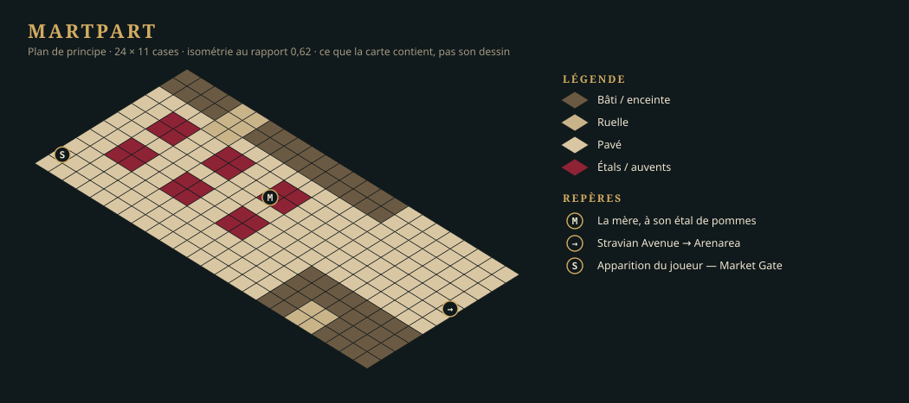
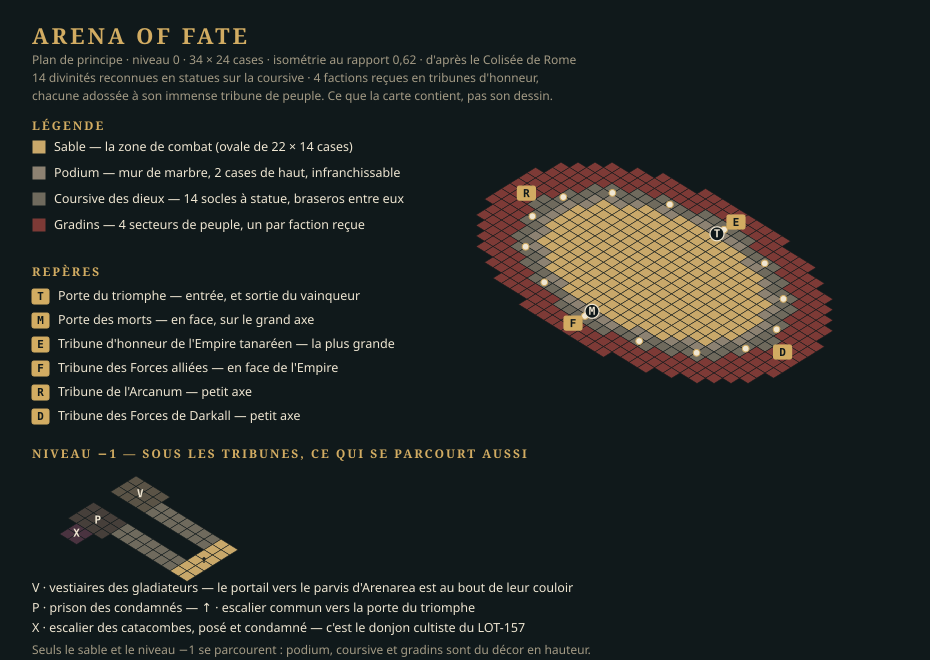

# Version 0.0.1 — démo basique

> **Livrée le 25 septembre 2026** — tag `v0.0.1`, recette au [LOT-122](lots/LOT-122-recette-et-version-0-0-1.md).
> Le [bilan de la version](bilan.md) dit ce qui a coûté plus que prévu et ce que la `0.0.2` en
> retient. Les mannequins ([LOT-145](../v0.0.2-combat/lots/LOT-145-mannequins-de-remplacement.md))
> sont partis à la `0.0.2` sans influencer la démo ([D-26](../../../vision/decisions.md)).

## Ce qui a changé le 25 septembre 2026

La démo ne produit plus ses zones. Ses lots de *world building* — assets, cartes et PNJ de
l'Arena of Fate et de Martpart, PNJ d'Arenarea (`LOT-106`, `LOT-107`, `LOT-110`, `LOT-111`,
`LOT-113`, `LOT-114`, `LOT-115`) — étaient trop complexes pour elle et partent à la
[`0.0.3`](../v0.0.4-lieux-de-la-demo/README.md), où ils s'inscrivent avec les six autres
quartiers ([D-25](../../../vision/decisions.md)). Les livraisons d'Arenarea (`LOT-108`, `LOT-109`)
sont loin du standard voulu pour le jeu final : elles se refont là-bas aussi (`LOT-147`), et la démo
n'en dépend plus.

Les **trois cartes enchaînées restent**, fortement réduites à des **cartes de principe** — ce que
les plans ci-dessous montrent, rien de plus —, en un seul lot :
[LOT-146](lots/LOT-146-cartes-de-principe-de-la-demo.md). Elles se jouent en maquette
([LOT-128](lots/LOT-128-cartes-maquettes.md)), et les PNJ y sont les **mannequins** du
[LOT-145](../v0.0.2-combat/lots/LOT-145-mannequins-de-remplacement.md) ou des jetons, en attendant leur production.

## Trois filières en parallèle

| Piste | Lots | Ce qui la bloque |
|---|---|---|
| **Le standard et le moteur HD** | LOT-101 → LOT-102, LOT-103 → LOT-104 → LOT-105 → LOT-129 ; LOT-112 (héros) — tous livrés ; les mannequins (LOT-145) sont partis à la `0.0.2` (D-26) | rien |
| **Le moteur de la quête** | LOT-116 (drapeaux, livré), LOT-117 (jet en dialogue), LOT-118 (combat sur la carte, livré), LOT-119 (écrans de fin) | rien |
| **Les cartes et la quête** | LOT-128 → LOT-126 → LOT-146 (les cartes de principe) → LOT-120 (la quête ; « Nouvelle partie » entre dans la démo), LOT-121 (l'onglet « Carte ») → LOT-122 (recette) — tous livrés | rien : l'éditeur est prêt (LOT-123 à LOT-127, livrés) |

## Ce que la démo contient

Trois lieux — deux quartiers et un donjon, l'Arena of Fate, sous-zone d'Arenarea, qui tient en deux
cartes (décision D-21 : un niveau est une carte) —, en cartes de principe ; cinq PNJ à rôle, tenus
par le mannequin humanoïde ou des jetons ; un adversaire ; quatre dialogues ; un drapeau de quête ; deux écrans de fin. Le
détail est dans [la fiche de la quête](quete-demo.md).

### Martpart

### Arenarea

### Arena of Fate — donjon d'Arenarea

## Ce que la démo ne contient pas

Ni sauvegarde, ni groupe, ni classes, ni expérience, ni marchand, ni audio, ni création de
personnage. Ni pièce propre à une zone, ni figurine de PNJ, ni foule : c'est la `0.0.3`.
L'Illu Die Arena, le casino et l'hippodrome sont des **façades** — sur une carte de principe, des
murs.

## Ce que la démo a produit quand même

Le standard 2D HD et sa chaîne de production, le kit commun de la Capitale (`LOT-105`), les
étages et les toits (`LOT-129`), le héros (`LOT-112`), et les pièces d'Arenarea (`LOT-108`) avec
sa carte (`LOT-109`) — ces deux derniers à reprendre. Les dix-huit pièces du Colisée installées par
le `LOT-104` restent sous `capital/arenarea/arena-of-fate/Scene/` : la carte de principe de l'arène
peut s'en habiller, sans que rien ne l'y oblige.
