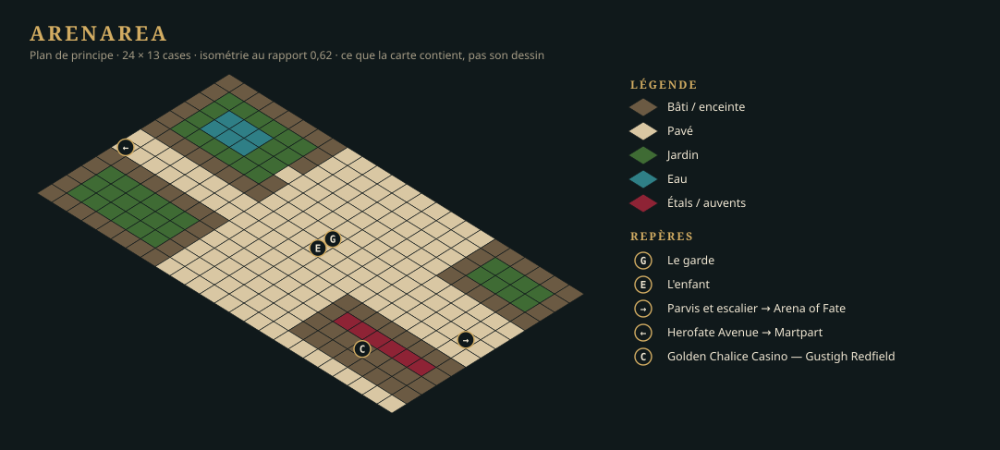

+++
id = "LOT-109"
titre = "Carte — Arenarea"
version = "0.0.1"
filiere = "cartes"
statut = "livre"
taille = "M"
resume = "Arenarea se parcourt, le quartier entier."
prerequis = ["LOT-108", "LOT-103", "LOT-124", "LOT-125", "LOT-128"]
livrables = [
  "`Levels/central-empire/capital/arenarea.json`, dessinée **dans l'éditeur**.",
  "Portails, points d'apparition nommés, zones (combat, déclencheurs de quête).",
]
criteres = [
  "`LevelEditor --check` passe : aucune case inatteignable, aucun portail sans arrivée, aucune référence morte.",
  "La carte tient 60 images par seconde à 1080p sur le poste de référence.",
]
maquettes = ["../maquettes/plan-arenarea.svg"]
+++

## Conception

La carte comprend Herofate Avenue du portail de Martpart au parvis de l'Arena of Fate ; le parvis, où le garde et l'enfant sont interceptés ; deux îlots de manoirs et leurs jardins ; la façade du casino.

Le plan ci-dessus est un **schéma de principe** : il fixe ce que la carte contient et comment on y
circule, pas son dessin.

## Le quartier entier (décision de l'auteur, 24 septembre 2026)

L'auteur a demandé la **zone complète**, pas la seule part que la démo parcourt : la carte
représente tout Arenarea, d'après le [référentiel de la Capitale](../../../../referentiels/central-empire/capitale.md)
(Sourcebook p. 91-92, 96-99) et le plan de la Capitale (`Map - Capital.jpg`, **référence
seule** : la carte en reprend la topologie, jamais le dessin). Le schéma de principe ci-dessus en
reste le cœur : Herofate Avenue, le parvis, les manoirs, le casino.

## Décisions de réalisation

1. **Une carte, 128 × 88 cases.** Repère : x va d'ouest en est du plan de la Capitale, y du nord
   au sud. L'échelle part de l'arène : ses 34 × 24 cases (celles de la carte du `LOT-107`)
   couvrent l'ovale du plan, soit une douzaine de pixels du plan par case. On y trouve, du nord au
   sud :
   - l'enceinte, avec la baie de Tourmaline au nord et à l'ouest, et la Rubicund River au
     nord-est ;
   - la Water Gate dans le rempart ouest ;
   - l'Arena Gate et son quai dans le rempart est, avec l'Arching Bridge jusqu'à la rive
     d'Oldtown ;
   - le Natural Pool et son parc ;
   - l'Arena of Fate (façade du Colisée à quatre ordres, porte du triomphe au flanc sud), Gauntlet
     Street qui l'entoure, le parvis et la Dusk of Justice à son pied ;
   - Herofate Avenue d'ouest en est, puis vers l'Arena Gate au nord et vers Martpart au sud ;
   - Inlet's Bazaar Block, le Golden Chalice Casino et sa rue des paris, la Cloaked Brewer sous le
     rempart de la rivière, Mapleleaf Plaza, l'Hippodrome et ses écuries, Whitebear Square ;
   - Greenwater Street, Lost Troll Corner, Sanguine Lane, Ayefall Street et Mason's Street, avec
     leurs îlots de maisons et de manoirs.
2. **Dessinée par l'éditeur, en gestes.** La carte est le produit de `LevelEditor --apply` :
   un fichier de gestes (pinceau, calques, entités), rejoué par les fonctions mêmes des outils. Le
   compositeur qui écrit ces gestes est un outil d'atelier : il reste hors dépôt, dans
   `Tools/AssetsHD/Regions/central-empire/capital/arenarea/Carte109/`, avec un aperçu rapide
   (`quarter.py --preview`). Le rejeu prend 90 s avec l'éditeur construit en Release. En Debug,
   il dépasse 30 min : chaque case posée recalcule la collision de toute la carte.
3. **Les assemblages validés du `LOT-108` sont réemployés tels quels :** manoirs, jonctions,
   casino et rue des paris, Cloaked Brewer et terrasse, Dusk of Justice, jardin à fontaine,
   écuries, hippodrome, quai et Arena Gate. Le reste des îlots est bâti avec un **gabarit de
   maison** tiré de ces manoirs : angles et travées de marbre, fenêtres et porte sur les faces
   vues, un à trois niveaux, toiture droite `roof-u/v-d{2..5}` avec départ et pignon. Les façades
   regardent +y, la rue du sud de chaque îlot. Aucune pièce n'est produite ni retouchée.
4. **Couches de débord** `relief-b`, `etage1-b` et `etage2-b`. Certains assemblages posent deux
   pièces sur la même case d'un même niveau (un mur et le solin de toit d'une jonction, deux
   haies d'angle). Une couche d'éditeur n'en tient qu'une par case, la seconde va donc sur la
   couche de débord de son étage. Rien n'est perdu.
5. **Des portails condamnés vers les cartes qui n'existent pas encore** (`sealed`, `LOT-126`) :
   Martpart au bas de l'avenue, l'Arena of Fate au pied de l'escalier du parvis, Oldtown à la
   tête de l'Arching Bridge, les Docks à la Water Gate. Ils prennent leur cible et leur arrivée
   quand les cartes naissent (`LOT-107`, `LOT-111`). Les points d'arrivée `from-martpart` et
   `from-arena-of-fate` sont posés. Les zones nommées `parvis` et `herofate-avenue` attendent les
   déclencheurs de la quête (`LOT-120`) ; le garde et l'enfant sont au `LOT-114`.
6. **Le tablier de l'Arching Bridge ne se parcourt pas** : ses pièces sont visuelles (V05). Le
   portail d'Oldtown est donc sur la rampe praticable, juste après la porte.
7. **Des rives droites.** Le kit de rives n'a pas de pièce en diagonale, et un contour en
   diagonale de grille se lit en escalier. Le Natural Pool est donc un grand bassin à longs bords
   droits et angles coupés, habillé de roseaux, de rochers et de buissons de berge.
8. **L'arène vue de dehors** : l'enveloppe, un podium de marbre au pied intérieur et le sable.
   Les gradins intérieurs n'existent pas dans le kit. Ils relèvent des pièces de l'Arena of Fate
   (`LOT-106`) et de sa carte (`LOT-107`).

## État au 24 septembre 2026

- `LevelEditor --check` : **0 erreur**, 23 avertissements attendus (pièces de couvert non encore
  jouées ; les deux points d'arrivée qu'aucun portail ne nomme encore).
- Le jeu ouvre la carte : `--map=central-empire/capital/arenarea`, avec `--levels=` sur les
  sources.
- **Critère des 60 images par seconde : tenu.** Le premier rendu recomposait toute la carte à
  chaque image : 82 s avant la première image en Debug, 11 ms de CPU par image en Release.
  L'[audit de l'affichage d'un lieu](../../../../standards/audit-affichage-lieu.md) en a fait une
  scène composée une fois et découpée à la vue (`hmi::StaticWorldScene`). La carte s'ouvre
  maintenant en 5 s en Debug. Une image coûte 0,07 ms de CPU, et le jeu tourne à 165 ips à
  1920 × 1080, soit la fréquence de l'écran, dans le build Debug.
- **L'image de la zone pour l'onglet « Carte »** part au
  [LOT-121](LOT-121-plan-de-la-capitale.md), avec celles de Martpart et de l'Arena of Fate. C'est
  une décision de l'auteur du 24 septembre 2026 : toutes les cartes de l'onglet se font dans le même
  lot.

## Relecture du 25 septembre 2026 : à refaire

Validée en l'état la veille, la carte est, comme les pièces du `LOT-108` qui l'habillent, **loin du
standard de qualité** que l'auteur veut pour le jeu final ([D-25](../../../../vision/decisions.md)).
Elle n'est pas la carte de la démo : la carte de principe d'Arenarea
([LOT-146](LOT-146-cartes-de-principe-de-la-demo.md)) prend son identifiant, et celle-ci reste dans
l'historique et dans l'atelier (`Carte109/`). Elle revient, reprise sur les pièces refaites, avec le
[LOT-147](../../v0.0.4-lieux-de-la-demo/lots/LOT-147-zone-arenarea-reprise.md) ; les portails
condamnés qu'elle posait vers Martpart et l'Arena of Fate prennent leur cible aux `LOT-111` et
`LOT-107`, à la `0.0.3` eux aussi.

## Livré le 24 septembre 2026

L'auteur a validé la carte et la correction de l'affichage : le lot est livré.
