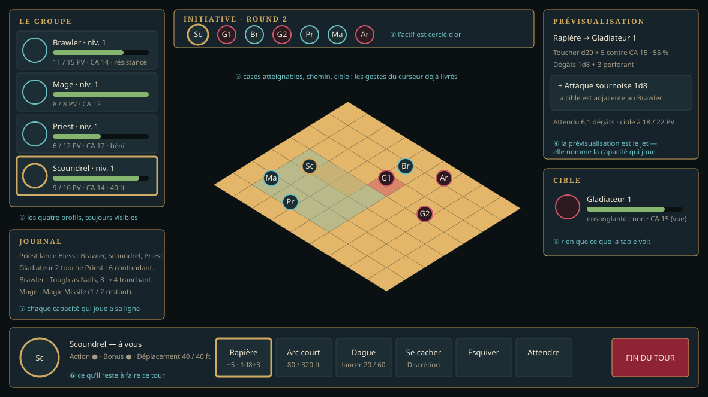

+++
id = "LOT-140"
titre = "L'interface de combat, à jour"
version = "0.0.2"
filiere = "interface"
statut = "livre"
taille = "M"
resume = "Le combat montre qui joue, qui suit, ce que chacun peut faire : profils, capacités, ressources."
prerequis = ["LOT-139"]
reprend = ["LOT-24"]
livrables = [
  "La **piste d'initiative** aux jetons des personnages.",
  "Le **panneau du personnage actif** : portrait, PV, CA, états, capacités et sorts avec leurs lancers restants.",
  "Les **profils** des adversaires, limités à ce que la table voit (règle du `LOT-23`).",
  "La prévisualisation d'une capacité : portée, zone, jet, dégâts attendus.",
]
criteres = [
  "Tout ce qu'un personnage peut faire à son tour est accessible sans souris.",
  "Les captures de référence QML sont à jour.",
]
maquettes = ["../maquettes/combat-de-groupe.svg"]
+++

## Pourquoi

Le `LOT-139` a mis les quatre en combat, mais l'écran est resté celui d'un héros seul (`LOT-24`,
`LOT-118`) : une piste d'initiative en puces de texte, un panneau de cible, une barre d'actions
qui coupe à huit, aucune prévisualisation depuis le retrait du Colisée. À quatre, le joueur doit
savoir **qui joue**, **ce qu'il lui reste** et **ce que sa capacité fera** avant de confirmer.

## Décisions de réalisation

Livré le 28 septembre 2026 (exigence `EX-IHM-108`), **PR #159**.

1. **La prévisualisation reste le jet — capacités comprises.** `core::previewAttack` comptait la
   CA, l'abri, la posture et la chance, mais ni le bonus au jet d'une capacité (*Hit the Mark*)
   ni ses dés à la touche (*Sneak Attack*) : depuis le `LOT-131`, le jet les jouait et l'écran
   les ignorait. L'aperçu porte désormais `attackBonus` et `capacityModifiers`, et `extraDamage` —
   une ligne par capacité, **avec sa condition lue comme la session la lit** : l'allié au contact
   (`core::isAdjacentToAllyOf`), la cadence « une fois par tour » dans les compteurs du combat
   (`CombatState::counters() const`, ajouté). L'espérance se calcule sur le profil « tel qu'il sera
   jeté », par la même formule que l'IA. Ce que l'écran nomme est ce qui jouera, ou pourquoi ça
   ne jouera pas (« un allié au contact de la cible est requis », « déjà jouée ce tour »).
2. **La vue-modèle publie, l'écran dispose.** `hmi::CombatModel` gagne `round`, `activeProfile`
   (niveau, classe, CA, états, ressources du tour, capacités, sorts avec lancers), `preview`
   (attaque, sort, déplacement, ou l'effet d'une action du *Manuel*), et ses listes s'enrichissent :
   `turnOrder` porte le jeton et deux initiales, `turnActions` le détail (« +5 · 1d8+3
   perforant », « 2 lancers · 36 m »), les lancers et l'icône. Qui est un membre du groupe, quel
   est son niveau, où est son jeton : `identityOf`, virtuel, que `EncounterModel` remplit depuis
   les fiches lues au montage et `Common/Characters/Heroes/<classe>/token.png` — le jeton du
   `LOT-136` n'était lu que par la galerie.
3. **L'icône d'un palier est celle de sa base.** `Rpg/capacities/README.md` le disait ; rien ne le
   faisait. `core::Capacity::iconId` est posé par `resolveCapacities` en suivant `replaces` :
   *Sneak Attack 3d8* montre l'icône de *Sneak Attack*.
4. **La place sur l'écran.** Le cadre commun (`HudFrame`) cède deux places en combat : la jauge
   d'expérience au **panneau du tour** (niveau, CA, états, pastilles d'action et d'action bonus,
   déplacement restant, capacités avec icône), les quêtes à la **prévisualisation**. L'ordre
   d'initiative passe en jetons ronds sous la boussole, l'actif cerclé d'or, un membre à terre
   éteint ; le round s'écrit au-dessus. La barre d'actions montre **huit cases en fenêtre
   glissante** autour de l'action choisie — un mage de niveau 5 en a quatorze —, les touches 1 à 8
   choisissant la case *visible* ; un clic sur une case la choisit aussi. L'action **Attendre**
   (annoncée par le `LOT-139`) rend la main depuis la barre. Les rôles facultatifs `down` de la
   colonne du groupe et `token`/`initials` de l'initiative gardent les formulaires lisibles dans
   l'atelier avec leurs valeurs d'exemple.
5. **La cible, telle que la table la voit** (`LOT-23`) : inchangée — pas de niveau, pas de
   portrait, les états visibles et « ensanglanté ». Un ennemi au tour de l'IA n'expose ni
   capacités ni sorts dans `activeProfile`.
6. **Capturer le HUD réel.** `--encounter=<id>` (build de développement, catalogue de la console
   `F9`) engage la rencontre dès l'arrivée sur la carte de `--map=` et ouvre le HUD : avec
   `--screenshot=`, la capture du combat de groupe ne demande aucun clic.

Tests : `test_combat_preview.cpp` (bonus au jet et dés d'une capacité, condition tenue ou non,
« déjà jouée ce tour »), `test_class_capacities.cpp` (`iconId`), `test_encounter_model.cpp` (round,
jetons et initiales, panneau de l'actif, détail des actions, prévisualisation de l'attaque, de la
case d'un allié, du déplacement), `QmlTests` (capture de référence `CombatHudForm.png` refaite).

## Ce qui n'est pas ici

- La prévisualisation d'un **sort** ne calcule pas d'espérance : elle dit le jet ou le DD, les dés,
  la zone, la portée ; l'espérance d'un sort à sauvegarde demande la sauvegarde de la cible, que
  la table ne connaît pas (`EX-CBT-050`).
- L'attaque à distance du Scoundrel dans la barre (`ranged` de sa fiche) : `heroContestant` ne
  prend toujours que l'arme en main directrice.
- Les portraits et jetons des **créatures** : deux lettres en attendant des assets.
